# 
计算机网络第二次作业

### 
10211900416 郭夏辉

#### 作业内容

第二章习题 P3 P18 P22 P23 P24 P25 P27

#### P3

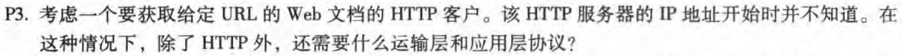

应用层：DNS HTTP 

运输层：TCP(HTTP 需要) UDP(DNS需要)

#### P18

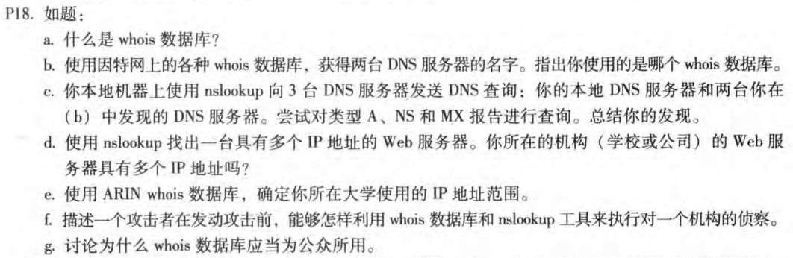

a.whois数据库是一个记录了域名的详细信息的数据库。比如：域名所有人，域名注册商，域名注册日期，域名过期日期。

b.我使用的whois数据库是[站长之家](https://whois.chinaz.com/)

查询的是github.com的DNS服务器信息:

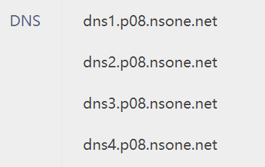

c.nslookup如果不设置参数默认为A类型

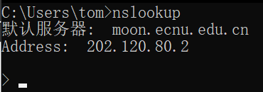

可以看到本地的DNS服务器是 moon.ecnu.edu.cn

本地DNS服务器:

类型A如下图所示:

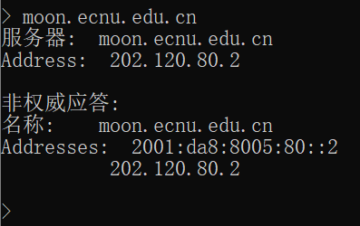

类型NS如下图所示:

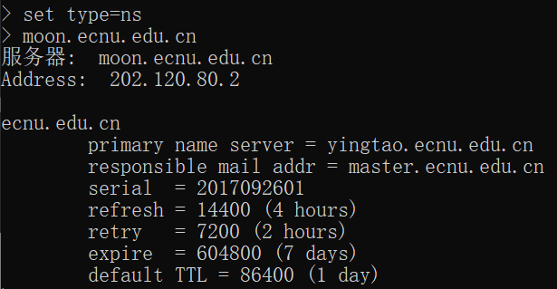

类型MX如下图所示:

(b)中第一个DNS服务器:dns1.p08.nsone.net

类型A如下图所示:

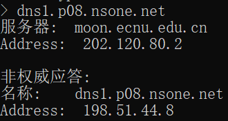

类型NS如下图所示:

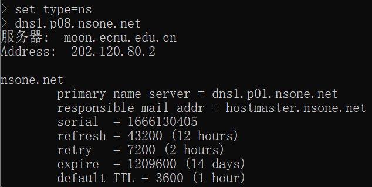

类型MX如下图所示:

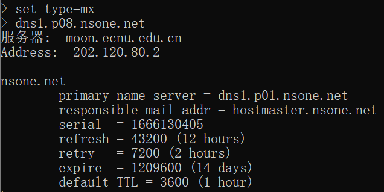

(b)中第二个DNS服务器:dns2.p08.nsone.net

类型A如下图所示:

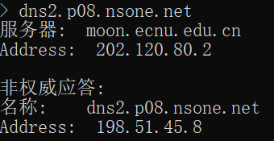

类型NS如下图所示:

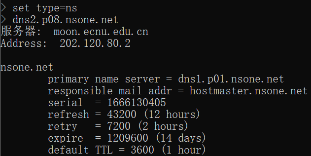

类型MX如下图所示:

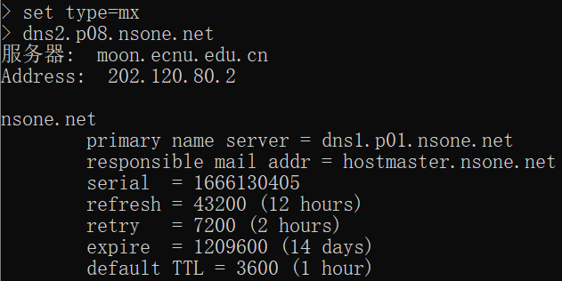

要理解结果的差异，首先来回顾一下三种类型:

类型A:A记录是用于名称解析的重要记录，提供标准的主机名到IP的地址映射。可以看到报告中包含主机名和IP地址。

类型NS:NS记录用来指定该域名由哪个DNS服务器来进行解析。注册域名时，总有默认的DNS服务器，每个注册的域名都是由一个DNS域名服务器来进行解析的。 简单的说，NS记录返回域中主机IP地址的权威DNS服务器的主机名。可以看到报告中包含域的地址和包含域中IP地址的权威DNS主机名。

类型MX:返回别名为Name对应的邮件服务器的规范主机名。可以看到报告中包含邮件服务器及其主机名。

d.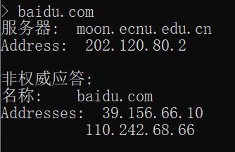

我所在的学校之Web服务器具有多个IP地址

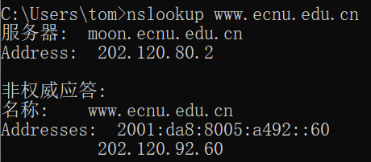

e.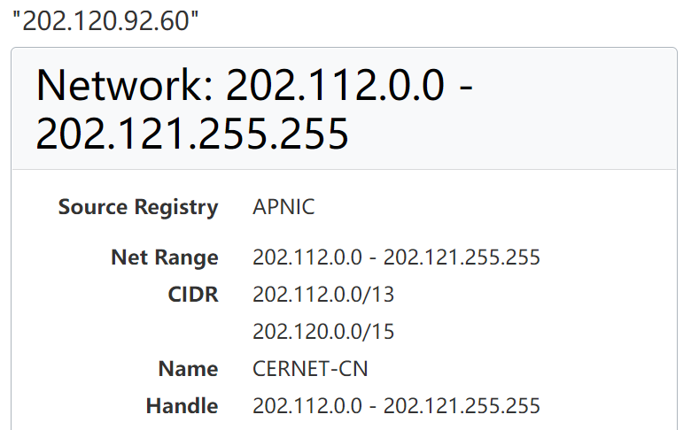

可以看到范围是202.112.0.0-202.121.255.255

f.攻击者可以利用whois数据库和nslookup来确定被攻击对象的IP地址范围、DNS服务器地址，进而方便发起攻击。

g.whois数据库显然应该为公众所用。举两个例子，个人注册自己的网站或者一些单位注册自己的官方网页时，他们都需要通过whois数据库来查看钟意的域名是否已经被注册过了；同时，面向公众的whois数据库也方便了消费者查询供应商网站的注册状态，使得他们更好地了解供应商的运营状况。

#### P22

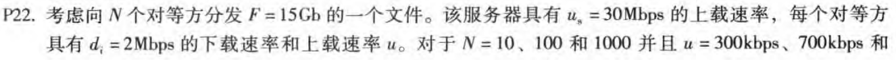

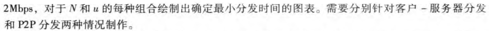

在C-S分发情况下:

$D_{CS}=max\{\frac{NF}{u_s},\frac{F}{d_{min}}\}=max\{512N,7680\}$

|    u\N   |   10   |   100   |   1000   |
| ---- | ---- | ---- | ---- |
|   300kbps   |   7680   |   51200   |   512000   |
|   700kbps   |   7680   |   51200   |   512000   |
|   2Mbps   |   7680   |   51200   |   512000   |

在P2P分发情况下:

$D_{P2P}=max\{\frac{F}{u_s},\frac{F}{d_{min}},\frac{NF}{u_s+\sum_{i=1}^{N}u_i} \}=max\{512,7680,\frac{15*2^{10}*2^{10}N}{30*2^{10}+Nu} \}$

(这里面u的单位以kbps记录)

|    u\N   |   10   |   100   |   1000   |
| ---- | ---- | ---- | ---- |
|   300kbps   |   7680   |   25904   |   47559   |
|   700kbps   |   7680   |  15616   |   21525   |
|   2Mbps   |   7680   |   7680   |   7680   |

#### P23

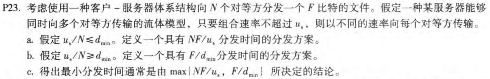

a.服务器向每个客户端并行发送文件，上载速率为$\frac{u_s}{N}$.由于$\frac{u_s}{N}\leq{d_{min}}$，因此客户端下载的速率也是$\frac{u_s}{N}$,这样每个客户端下载完成的时间为$\frac{F}{\frac{u_s}{N}}=\frac{NF}{u_s}$

b.服务器向每个客户端并行发送文件，上载速率为$d_{min}$,由于$\frac{u_s}{N}\geq{d_{min}}$，因此$u_s\geq{Nd_{min}}$,服务器可以承受此速率，这样每个客户端以$d_{min}$速率下载，接收时间为$\frac{F}{d_{min}}$

c.若$\frac{u_s}{N}\leq{d_{min}}$,$\frac{NF}{u_s}\geq{\frac{F}{d_{min}}}$,此时$t=\frac{NF}{u_s}=max\{\frac{NF}{u_s},\frac{F}{d_{min}}\}$

若$\frac{u_s}{N}\geq{d_{min}}$,$\frac{NF}{u_s}\leq{\frac{F}{d_{min}}}$,此时$t=\frac{F}{d_{min}}=max\{\frac{NF}{u_s},\frac{F}{d_{min}}\}$

综上所述，$t=max\{\frac{NF}{u_s},\frac{F}{d_{min}}\}$

#### P24

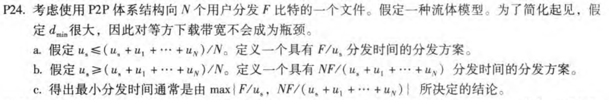

为了讨论方便$u=\sum_{i=1}^{N}u_i$

这道题目还是非常复杂的，我采用的是逆向思路法。

a.

分发方案：

将文件分为 N 个块，第i个块大小为 $\frac{u_i}{u}F$比特，服务器并行地向第 i 个客户端以速率$\frac{u_i}{u}u_s$传送第 i 个块，每个对等方向其他所有N-1个对等方以速率$\frac{u_i}{u}u_s$传送自己拥有的文件块。

采用这个方案，由于$\frac{u_1}{u}u_s+\frac{u_2}{u}u_s+...\frac{u_N}{u}u_s=\frac{u}{u}u_s=u_s$,服务端向客户端发送数据的总上载速率没有超过其限度。由于下载速率$d_{ min}$很大，$\frac{F}{d_{min}}$很小，下载链路不会成为主要制约因素，因此可以认为第i个客户端接收到来自服务端的文件所需时间为$\frac{\frac{u_i}{u}F}{\frac{u_i}{u}u_s}=\frac{F}{u_s}$.

每一个客户端在接收到来自服务端的数据块的同时，也在向其他所有用户传输自己所拥有的数据，对于第i个客户端，它发送给另外一个客户端的速率都是$\frac{u_i}{u}u_s$（和服务端传数据给它的速率一致,达到最快了）。总共要给其他N-1个客户端发送自己的数据，这样总的传输速率是$(N-1)\frac{u_i}{u}u_s$。

根据题意，可以知道$u_s\leq{\frac{u_s+u}{N}}$,即$\frac{(N-1)u_s}{u}\leq1$,即$(N-1)\frac{u_i}{u}u_s\leq{u_i}$,可以知道该客户端的总上载速率并没有超过其极限，这样是可行的。

对于第i个客户端而言，它需要多少时间获得来自其他客户端的数据呢？拆分的分析是不容易的，我采用了聚合分析的方法。其他客户端发送给第i个客户端的聚合速率是$\sum_{k=1}^{N}\frac{u_k}{u}u_s-\frac{u_i}{u}u_s$,然后服务器给第i个客户端发送的速率是$\frac{u_i}{u}u_s$,两者相加得到聚合速率$\sum_{k=1}^{N}\frac{u_k}{u}u_s=u_s$.需要发送的数据量是$F$比特。同时，由于下载速率$d_{ min}$很大，下载链路不会成为主要制约因素，可以知道这个客户端能在$\frac{F}{u_s}$时间内获取所有来自其他客户端的数据。

综上，这个方案能达到要求。

b.

分发方案：将文件分为N+1个块，第i块的大小是$\frac{Nu_i}{(u_s+u)(N-1)}F,i=1,2,...N$,第N+1块的大小是$\frac{Nu_s-u_s-u}{(u_s+u)(N-1)}F$

服务器并行地向所有客户端以速率$\frac{u_s-\frac{u}{N-1}}{N}$传送第N+1个块，与此同时并行地向第i个客户端以上载速率$\frac{u_i}{N-1}$传送第i个数据块，每个对等方向其他所有N-1个对等方以速率$\frac{u_i}{N-1}$传送自己拥有的文件块。

采用这个方案，服务器给客户端的上载速率之和为$N\frac{u_s-\frac{u}{N-1}}{N}+\sum_{i=1}^{N}\frac{u_i}{N-1}=u_s-\frac{u}{N-1}+\frac{u}{N-1}=u_s$,服务端向客户端发送数据的总上载速率没有超过其限度。由于下载速率$d_{ min}$很大，$\frac{F}{d_{min}}$很小，下载链路不会成为主要制约因素，因此可以认为第i个客户端接收到来自服务端的文件所需时间为$\max\{\frac{\frac{Nu_s-u_s-u}{(u_s+u)(N-1)}F}{\frac{u_s-\frac{u}{N-1}}{N}},\frac{\frac{Nu_i}{(u_s+u)(N-1)}F}{\frac{u_i}{N-1}}\}=\frac{NF}{u_s+u}$.

每一个客户端在接收到来自服务端的数据块的同时，也在向其他所有用户传输自己所独有的数据，对于第i个客户端，它发送给另外一个客户端的速率都是$\frac{u_i}{N-1}$（和服务端传数据给它的速率一致,达到最快了）。总共要给其他N-1个客户端发送自己的独有的数据，这样总的传输速率是$u_i$,可以知道该客户端的总上载速率并没有超过其极限，这样是可行的。

对于第i个客户端而言，它需要多少时间获得来自其他客户端的数据呢？类似于a题我采用了聚合分析的方法。其他客户端发送给第i个客户端的聚合速率是$\frac{1}{N-1}(u-u_i)$,服务器向这个客户端发送的速率是$\frac{u_s-\frac{u}{N-1}}{N}+\frac{u_i}{N-1}$,这两者相加，得到总的聚合上载速率是$\frac{u}{N-1}+\frac{u_s-\frac{u}{N-1}}{N}$,需要发送的数据量是$F$比特。同时，由于下载速率$d_{ min}$很大，下载链路不会成为主要制约因素，可以知道这个客户端能在$\frac{NF}{u_s+u}$时间内获取所有来自其他客户端的数据。

综上，这个方案能达到要求。

c.

根据课本前面的理论，可知$D_{P2P}=max \{ \frac{F}{u_s}, \frac{F}{d_{min}}, \frac{NF}{u_s+\sum_{i=1}^{N}u_i} \}$

但是在下载速率$d_{ min}$很大的情况下，$\frac{F}{d_{min }}$很小，可以忽略不计

综上，结合a,b题中证明的相关理论，可以知道最小分发时间在这样的情况下通常是由$max \{ \frac{F}{u_s},  \frac{NF}{u_s+\sum_{i=1}^{N}u_i} \}$所决定的，问题得证。

#### P25

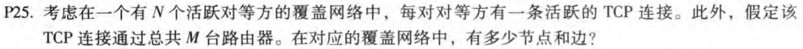

在这个网络中，有$N$个结点。

边数为$1+2+...+(N-1)=\frac{(N-1)N}{2}$

#### P27

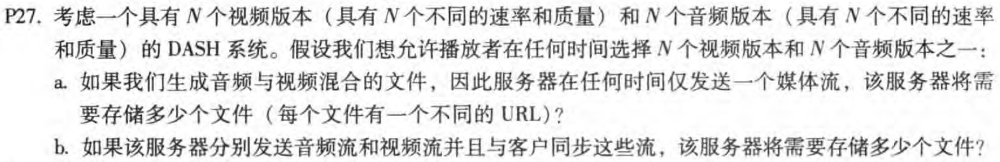

a.根据题目，我们按照质量和速率降序一对一地去匹配音频和视频，生成了音频和视频混合的文件就行了，所以这种情况下服务器要存储N个文件。

b.根据题目，服务器要分别发送音频和视频文件，这样的话服务器要存储N个视频文件和N个音频文件，总计要存储2N个文件。

