# 
计算机网络第三次作业

### 
10211900416 郭夏辉

### 作业内容

第三章习题 P3 P11 P14 P18 P21 P22 P23 P26 P36 P37

### P3

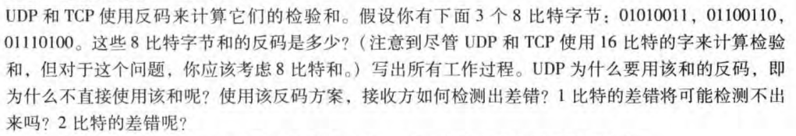

01010011+01100110=10111001 

10111001+01110100=00101110

这里要注意在溢出时应该"回卷"(向最低位进位)

因此它们的和的反码是11010001

使用和的反码的好处:

1.不依赖系统是大端还是小端

2.计算检验和比较简单快速

接收方检验差错的方法:

将三个字节与检验和相加，如果任何一个位为 0，说明出错

1 比特的差错肯定会导致结果不同

2 比特的差错可能会检测不出，比如题中第一、二字节变为 01010010，01100111，即最后一个比特反转，然后就检测不出来了。

### P11

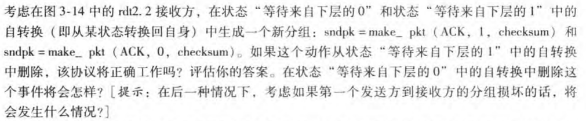

如果从“等待来自下层的 1”中删除，不会影响正常工作，因为 sndpkt 已经被生成了。

但如果从“等待来自下层的 0”中删除，而且接收方刚刚启动（处于初始状态），sndpkt 是一个错误的值（可能是一个随机值），那么发送方会认为 ACK 损坏并重发分组，接收方会继续发送错误值，这将导致一个死锁。

### P14

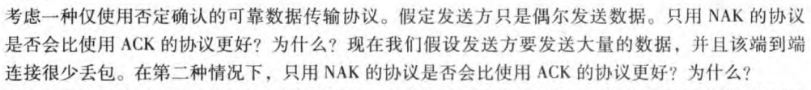

1.只用 NAK 协议不会比使用 ACK 协议更好。因为接收方判断丢失的依据其实是数据传送的上下文，只有在丢失的包的的下一个包被接受时才会发现丢包。而且在偶尔发送数据情况下，发送方发送各个数据包之间的间隔较长，这一段较长的时间内丢失的数据包一直没有被重发。综上所述，此情况下只用 NAK 协议不会比使用 ACK 协议更好。

2.只用 NAK 协议不会比使用 ACK 协议更好。我们先来分析一个较为理想的条件，即不丢包情况。如果采用停等协议，发送方必须等待最长的RTT时间，才能确认接收方已经收到，相比于ACK协议，NAK协议时间的花费会更长；如果采用流水线协议，那么发送方发送的报文如果损坏，接收方无法判断其序号，无法发送NAK报文，发送方会认为这个报文已经正确接收。因此发生错误。如果按照题目中的描述是较少丢包的情况，相同时间中只使用NAK协议发送的数据包数量明显比 ACK 协议少，因此并不好。

### P18

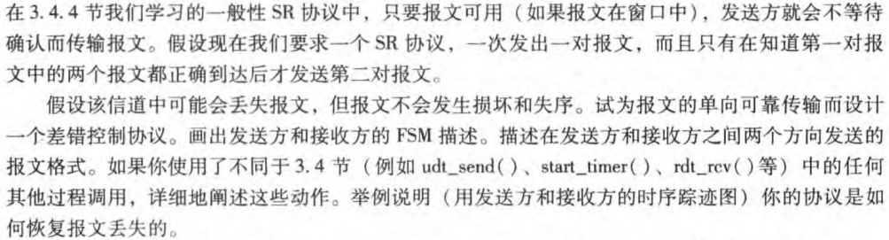

我的思路是这样的，这个和我们传统所学不一样之处在于它是一对一对地发送数据，发送方等待一对的ACK到来之后采取发送下一对的数据。每个数据包都要设置一个额外的数据区来存储分组的编号，我的想法是只用设置2位，4个编号就行(seqnum是0,1,2,3),ACK信息要包含对应的编号。对应的FSM如下所示:

发送方:

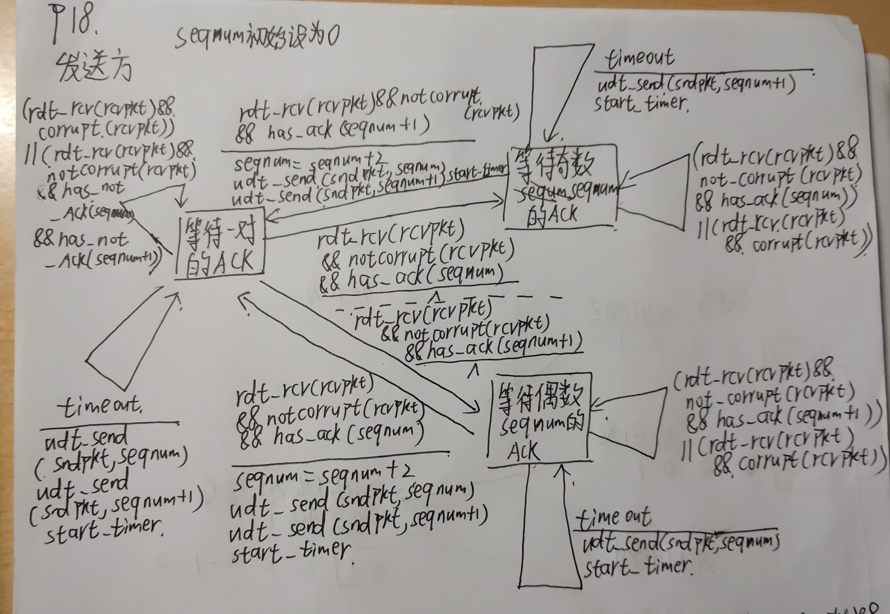

接收方:

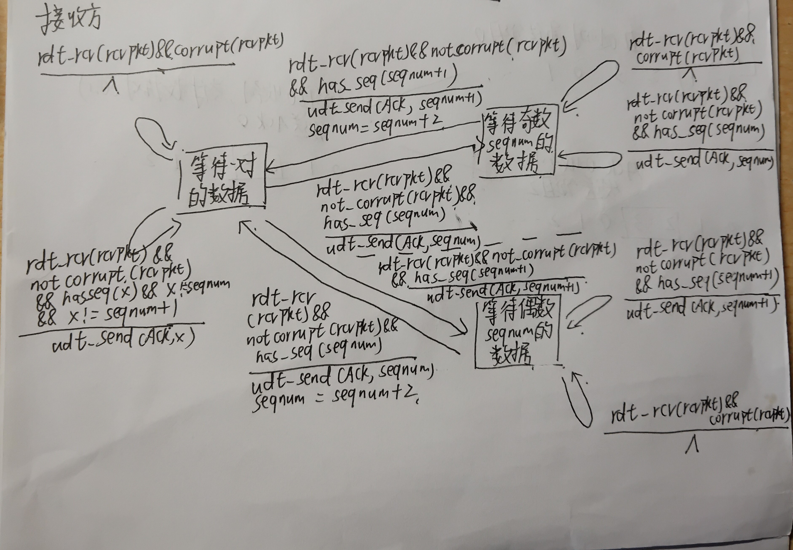

举例分析:

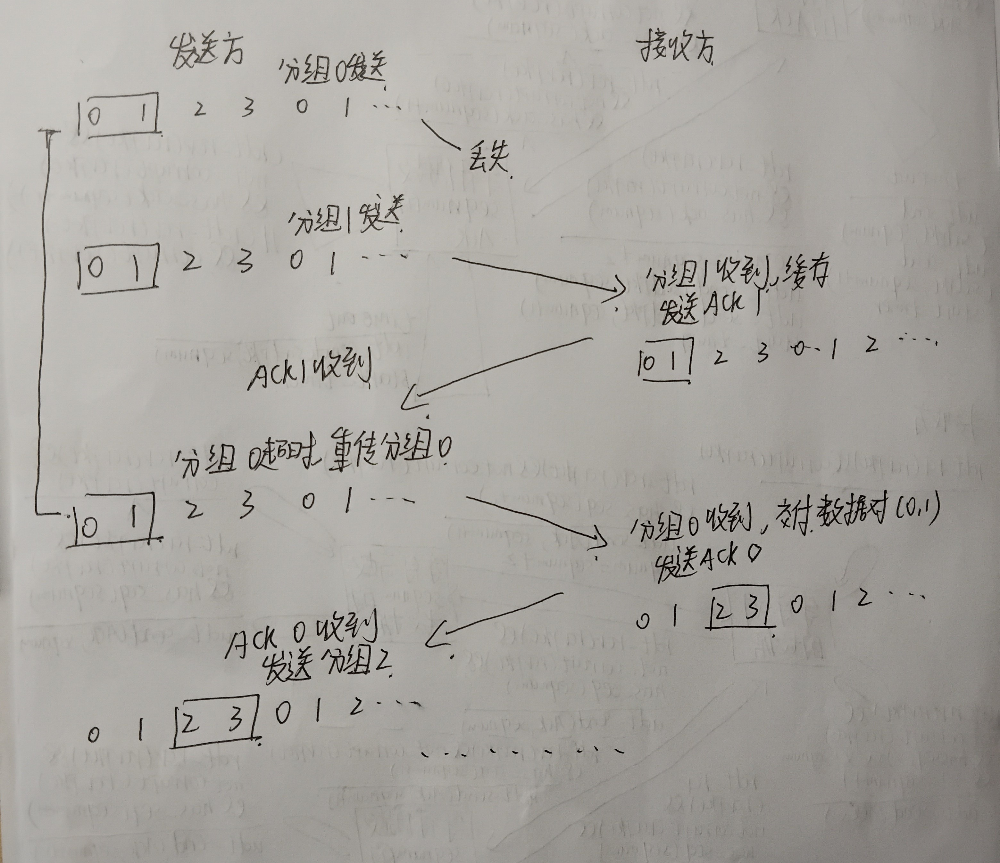

### P21

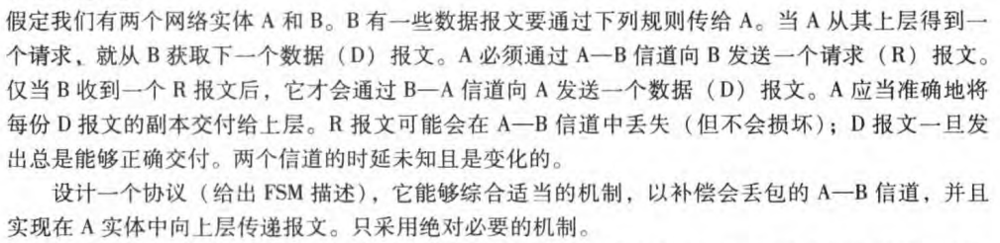

由于 A--B 通道可能会丢失请求消息，因此 A 需要超时并重新传输其请求消息（以便能够从丢失中恢复）。由于信道延迟是可变的和未知的，因此 A 可能会发送重复的请求（即重新发送B 已经接收到的请求消息）。为了能够检测重复的请求消息，协议将使用序列号。1 位序列号足以满足停止和等待类型的请求/响应协议。

对应的FSM图:

A（请求者）:

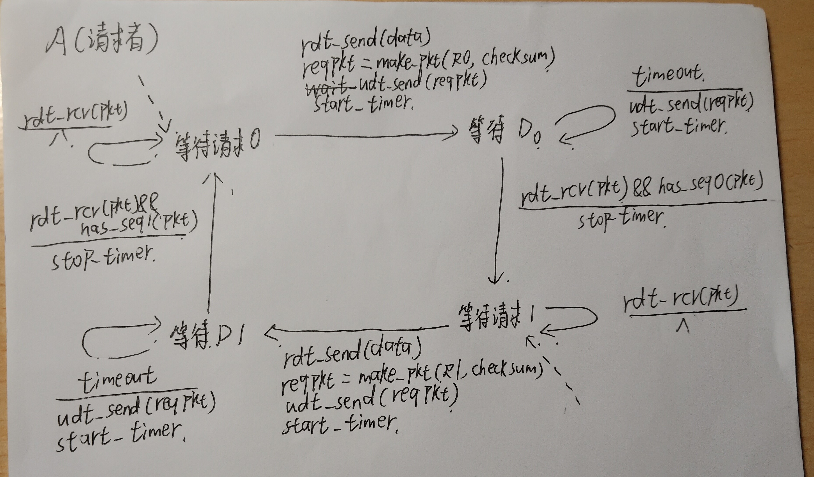

B（供应者）:

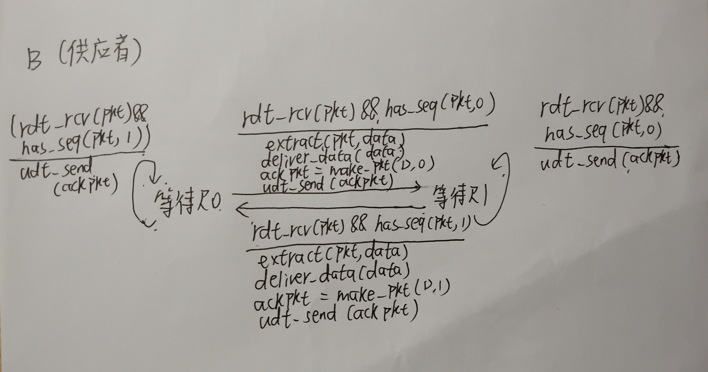

### P22

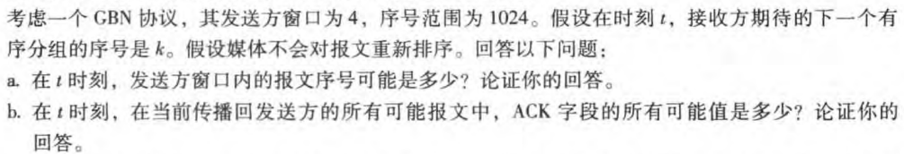

a.这个题考虑两种最极端的情况即可:

1.发送方发送 k-4，k-3，k-2，k-1，接收方都完整得接收并发送 ACK，但 ACK 全都未传到发送方，接收方的期待序号为 k，此时发送方窗口序号可能值的取值范围为 [k-4, k-1]

2.发送方发送了k, k+1, k+2, k+3报文，接收方还没有收到，此时发送方窗口序号可能值的取值范围为 [k, k+3]

综上所述，发送方窗口序号可能值的取值范围是为 [k-4, k+3]

b.类似于a题的思路。

如果接收方期待 k，则它一定将比 k-1 小的 ACK 发送出去了；

如果要使发送方发送k-1，那么它至少已经接收到了 k-5 的 ACK，否则窗口不会向后滑动。 

因此正在传播回发送方的 ACK 序号可能值的取值范围是 [k-4, k-1]

### P23

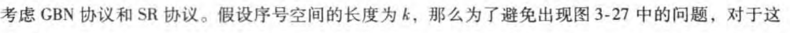

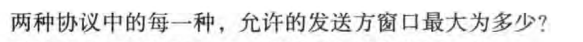

这个题目其实就是老师那次上课让我们做的那个小小的拓展任务。

#### SR

其实有一个小小的细节，就是接收方的窗口尺寸可以和发送方不一样吗？我在纸上写了很多的例子，发现不一样也是可以的。但是需要满足接收方的窗口大小不超过发送方的窗口大小（否则在逻辑上是不成立的）。为了方便论述，我在这里只讨论接收方和发送方的窗口大小一样，如果不一样，也是同理的，毕竟求的是上界。

假设序号空间的大小为$N$,窗口的大小是$M$,我们将发送的分组按次序这样去标号:

`0 1 2 ...... N-1 N N+1 ...... 2N-1 ...... `

当然它们的序号是:

`0 1 2 ...... N-1 0 1 ...... N-1 ...... `

这个很容易用取模运算来描述:序号是h(u),标号是u `h(u)=u mod N` 

在这样的情况下，我们如何来描述问题呢？什么时候会出现不成立的情况？

出现矛盾的本质其实是接收方无法判断来自发送方的重传到底是真的重传呢还是新的分组呢，这又是因为接收方相对于发送方的窗口来说，存在一个序号一样，但是标号不一样的元素！

假设$u,v$是非负整数标号，$u$是来自发送方的窗口之标号，$v$是来自接收方的窗口之标号，满足$h(u)=h(v),u\not=v$

$u,v$之间的距离$|v-u|$最大能有多大？

接收方在发回$ACK$确认时可能会出现无序、丢失现象，这个会使得发送方和接收方的窗口移动并不总是同步。这个不同步使得接收方的窗口移动相较于最初移动的程度大于等于发送方的窗口，则$u < v$.

我们取一个最极端的情况，让发送端的那个窗口一直不移动，但是接收端的窗口总是能移动——接收端发出的$ACK$全部都丢失了。在这个情况下，两个窗口能恰恰好好地交错开:

发送窗口:`i i+1 i+2 ... u ... i+M-1 `

接收窗口:`i+M i+M+1 ... v ... i+2M-1`

交错开之后，两个窗口共有$2M$个元素，当然如果继续让接收窗口往右边走一点也是可以的，这样从发送数组第一个元素到接收窗口最后一个元素（包括这两个）就有了$2M+t$个元素。然后我们可以发现一个不等式

$[u,v]$之间的元素个数$v-u+1$应该不超过$ 2M+t $

即$v-u+1 \leq 2M+t ,t\geq0 $

其中$v-u=kN, k\geq1,k\in N^{+}$

由恒成立性和一般性，可以导出不成立情况下的解:$2M \geq N+1$

也很容易就可以证明这个解是不成立情况下解的全集。

取补集，得$2M<N+1$由于皆为整数，$2M\leq N$

#### GBN

相对来说这个更容易去讨论，但是其实也是有点复杂的。

由于接收方的窗口大小只为1，这个很方便去讨论:

1. 如果接受窗口在发送窗口之间，这时只要能满足发送窗口内没有重复的序号之分组，就可以区分(否则就不能，因为接收方发送一个有重复序号的分组的ACK,接收方就分不清楚了),可以得到$M\leq N$
2. 如果接受窗口在发送窗口最左侧，发送方发送一个分组正在等待确认，这个时候与第一种情况类似，同样只要能满足发送窗口内没有重复的序号之分组，就可以区分，即$M \leq N$
3. 如果接受窗口在发送窗口最右侧的下一个，接收方收到了所有的分组，还没来得及确认完。在这种情况时要求发送方和接收方内部没有重复的序号之分组，否则，若发送方发送了一个有重复标号的分组，接收方会以为收到了，但其实不对呢，这时即$M+1 \leq N$

综上所述$M\leq N-1$

#### 总结

更为一般地，假设发送方的窗口大小$W_s$

SR协议: $2 W_s \leq N$

GBN协议: $W_s \leq N -1$

### P26

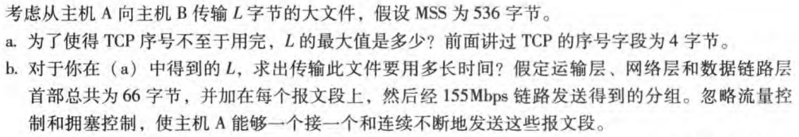

a.TCP是按字节流编号的，4字节对应的是32位，L的最大值为$2^{32}bytes$

b.设报文数为N,$N=\lceil \frac{2^{32}}{536} \rceil=8012999$

总头部长$66*N = 528857934 bytes$

总字节数$2^{32}+528857934=4823825230 bytes$

时间$\frac{4823825230*8}{155*1000*1000}=249s$

### P36

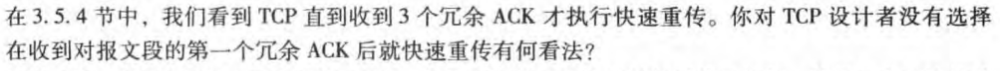

如果收到一个冗余ACK后就快速重传，那么两个连续发送的报文，在反序到达时，也会发生重传情况。也就是说协议不允许失序到达报文，然而这种重传是没有必要的。
因此我觉得这种设计并不是很好。

### P37

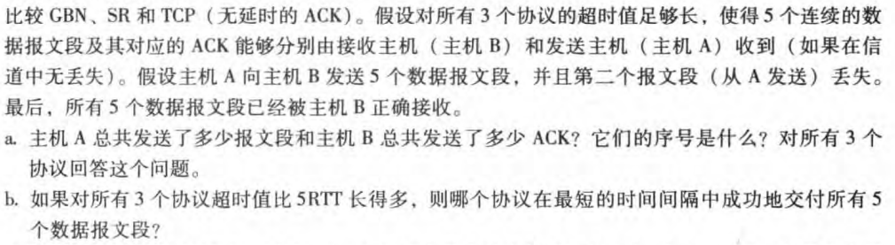

a.

GBN:

A：首先发送分组 12345，后来重发 2345，总共 9 个分组 

B：首先发送 ACK 1111，后来发送 2345，总共 5 个 ACK 

SR:

A：首先发送分组 12345，后来重发 2，总共 6 个分组 

B：首先发送 ACK 1345，后来发送 2，总共 5 个 ACK 

TCP:

A：首先发送分组 12345，后来重发 2，总共 6 个分组 

B：首先发送 ACK 2222，后来发送 6，总共 5 个 ACK

b.

GBN、SR 需要等待超时，而 TCP 使用快速重传，因此TCP最快。
