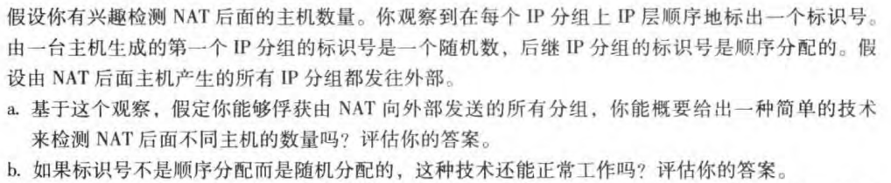

# 
计算机网络第四次作业

### 
10211900416 郭夏辉

## 作业内容

第四章习题 P6 P8 P11 P15 P17 P19 P20

## P6

注意地址的最大长度只有8位

| 前缀匹配 | 接口 | 地址范围          | 数量 |
| -------- | ---- | ----------------- | ---- |
| 00       | 0    | 00000000-00111111 | 64   |
| 010      | 1    | 01000000-01011111 | 32   |
| 011      | 2    | 01100000-01111111 | 32   |
| 10       | 2    | 10000000-10111111 | 64   |
| 11       | 3    | 11000000-11111111 | 64   |

## P8

三个子网的所有接口要求具有前缀223.1.17/24，则地址的前24位是一样的，不同的地方在于最后8位，我们只要着手去设计最后8位来满足题中的限定条件就行。

先来设计子网1，因为要求多达60个接口，最靠近60且不小于60的2的幂次数字是64，这需要用6位来表示。我选择00000000-00111111作为子网1地址的区间，这样子网1的地址可以为223.1.17.0/26

再来设计子网2，因为要求多达90个接口，最靠近90且不小于90的2的幂次数字是128，这需要用7位来表示。子网1已经占用了00000000-00111111这个区间，总的可能情况只有256($2^8$),前一半我们不能用了，我们接下来只能选择10000000-11111111，这样子网2的地址就成了:223.1.17.128/25

最后来设计子网3，因为要求多达12个接口，最靠近12且不小于12的2的幂次数字是16，这需要用4位来表示。然后根据最长前缀匹配规则，我们只要让后八位的前四位一样就行(8-4=4),但是这个不能和子网1和子网2一样，我选择是1100，然后选择的范围是11000000-11001111，这样子网3的地址就成了:223.1.17.192/28

## P11

128的二进制是10000000，然后128.119.40.128/26的前26位是一样的，因此最后6位的可能情况为(10)000000-(10)111111,范围是128.119.40.128-128.119.40.191

64的二进制是01000000，然后128.119.40.64/26的前26位是一样的，则最后八位的范围是01000000-01111111，总的可能情况是64，64/4=16，四个子网拥有的IP地址数量都是16(需要4位来表示)。

第一个子网01000000-01001111 128.119.40.64/28

第二个子网01010000-01011111 128.119.40.80/28

第三个子网01100000-01101111 128.119.40.96/28

第四个子网01110000-01111111 128.119.40.112/28

## P15

TCP首部20字节，IP 首部20字节，共40字节。然后MTU是1500字节，这样一来承载数据的有效载荷只能有1460(1500-40)字节。

5MB是$5*1000*1000$字节

这样需要$\lceil \frac{5*1000*1000}{1460}  \rceil=3425$个数据报

## P17

a.我的想法是通过连续的标识号来识别出这是一台计算机发出的。例如当前俘获的一堆标识号分别为:[100,101,201,102,202,203,300,301]，那么就有三个连续的标识号序列，分别为：[100,101,102], [201,202,203], [300,301]。可以确定该 NAT 路由器后面有 3 台主机。

但是我的思路有一个问题，就是如果主机初始时生成的随机数是一样的，或者发送的分组太多，这样就很容易造成混淆而无法检测NAT后面不同主机的数量了。

b.不能正常工作了，因为分不清是新主机还是同一主机的不同报文。

## P19

| 匹配                                                       | 动作        |
| ---------------------------------------------------------- | ----------- |
| Ingress Port = 1; IP Src = 10.3.\*.\*; IP Dst = 10.1.\*.\* | Forward (2) |
| Ingress Port = 2; IP Src = 10.1.\*.\*; IP Dst = 10.3.\*.\* | Forward (1) |
| Ingress Port = 1; IP Dst = 10.2.0.3                        | Forward (3) |
| Ingress Port = 2; IP Dst = 10.2.0.3                        | Forward (3) |
| Ingress Port = 1; IP Dst = 10.2.0.4                        | Forward (4) |
| Ingress Port = 2; IP Dst = 10.2.0.4                        | Forward (4) |
| Ingress Port = 4                                           | Forward (3) |
| Ingress Port = 3                                           | Forward (4) |

## P20

| 匹配                                  | 动作        |
| ------------------------------------- | ----------- |
| Ingress Port = 3; IP Dst = 10.1.\*.\* | Forward (2) |
| Ingress Port = 3; IP Dst = 10.3.\*.\* | Forward (2) |
| Ingress Port = 4; IP Dst = 10.1.\*.\* | Forward (1) |
| Ingress Port = 4; IP Dst = 10.3.\*.\* | Forward (1) |

