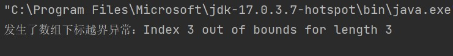

# <center>华东师范大学数据科学与工程学院实验报告</center>

|课程名称:计算机网络与编程 | 年级:22级 | 上机实践成绩: |
| ---- | ---- | ---- |
| 指导教师:张召 | 姓名:郭夏辉 | 学号:10211900416 |
| 上机实践名称:Java编程基本语法和基础2 | 上机实践日期:2023年3月17日 | 上机实践编号:No.03 |
| 组号:1-416 | 上机实践时间:2023年3月17日 |      |

------


## 一、实验目的

- 熟悉并掌握IntelliJ IDEA的使用
- 学习并掌握Java面向对象部分的基础知识，为使用Java进行网络编程打下基础

## 二、实验任务

- 熟悉继承、多态、接口、抽象类、异常处理以及枚举等相关内容

## 三、实验环境

- Intellij IDEA 2022.3.2
- JDK 19

## 四、实验过程

### task1

#### 题目

设计⼀个名为StopWatch（秒表）的类，该类继承Watch（表）类：

```c
Watch类包含：私有数据域startTime和endTime，并包含对应访问⽅法，⼀个名为 start() 的⽅法，将startTime重设为当前时间，⼀个名为 stop() 的⽅法，将endTime设置为当前时间；
StopWatch类另包含：⼀个名为 getElapsedTime() 的⽅法，以毫秒为单位返回秒表记录的流逝时间；在Main函数测试StopWatch类功能。
```

#### 设计思路

首先我要完成`Watch`类。最开始我看到题目要求，“私有数据域startTime和endTime”，还以为要把这两个变量用private修饰，但是在调试过程中一直无法运行，后来才发现private修饰的数据段只能在类内部和本包访问，子类都不行，所以我在父类的内部定义了`getst`和`geted`这两个方法来获取初始和结束的时间。

还有一个问题便是获取当前时间的方式，我在网上找了很多的方法，发现使用`java.util`的Date类是比较方便的，而且这个类的`getTime()`方法能以毫秒为单位返回当前时间，是符合对`getElapsedTime()`方法的设计预期的。

#### Watch类

```java
import java.util.Date;
class Watch {
    private long startTime,endTime;
    public Date st1,ed1;
    public void start(){
        st1=new Date();
        startTime=st1.getTime();
    }
    public void stop(){
        ed1=new Date();
        endTime=ed1.getTime();
    }
    public long getst(){
        return this.startTime;
    }
    public long geted(){
        return this.endTime;
    }
}
```

#### StopWatch类

好的，之后就可以很容易得到`StopWatch`类了，这里别忘了通过`extends`关键字来继承呀。

```Java
class StopWatch extends Watch{
    public long getElapsedtime(){
        long ans=this.geted()-this.getst();
        return ans;
    }
}
```

#### Main类

最后就是在`Main`类中测试StopWatch类功能了。计算机的运行速度是飞快的，简单的操作还要捕获毫秒级的运行时间需要来构造一下。我想到了通过1000*1000矩阵乘法的乘法来放大化计算时间，代码如下所示。

```java
public class Main {
    public static void main(String[] args) {
        StopWatch stopWatch=new StopWatch();
        int [][]a=new int [1000][1000];
        for(int i=0;i<1000;i++){
            for(int j=0;j<1000;j++){
                a[i][j]=i+j;
            }
        }
        int [][]b=new int [1000][1000];
        stopWatch.start();
        int tmp;
        for(int k=0;k<1000;k++){
            for(int i=0;i<1000;i++){
                tmp=a[i][k];
                for(int j=0;j<1000;j++){
                    b[i][j]+=tmp*a[k][j];
                }
            }
        }
        stopWatch.stop();
        long result=stopWatch.getElapsedtime();
        System.out.println((stopWatch.st1).toString());
        System.out.println((stopWatch.ed1).toString());
        System.out.println(result);
    }
}
```

#### 输出结果

```
Tue Mar 17 10:39:20 CST 2023
Tue Mar 17 10:39:20 CST 2023
724
```

可以看到刚刚的矩阵乘法花费了724毫秒左右，还是十分直观的。

### task1(optional)

#### 题目

回顾C++的继承⽅式，其有public继承、protected继承和private继承，后两种常⽤作空基类优化等技巧，然⽽Java只有⼀种继承⽅式extends，这是为什么？

#### 解答

首先，其实我对C++和Java的继承机制深入原理在完成作业之前并没有特别深入的了解，在查阅了很多资料后，我来谈一下自己的感想。

- 在C++中，public、protected和private继承方式是为了控制派生类对基类成员的访问权限，灵活运用的同时可以用于空基类优化这样的特殊技巧。但是可能会出现的多重继承和菱形继承这样的问题，更不必说C++那强大但很复杂的指针和引用机制了。
- 在Java中，访问控制是通过关键字来实现的，而不是通过继承方式来实现的。public、private和protected在Java中是访问控制关键字，可以用来限制类、方法和变量的访问范围。因此，Java中只提供了一种继承方式extends，而访问控制关键字用来控制继承关系中的访问权限。这种设计简化了语法和概念，使得Java更加易用和安全。
- 总而言之，C++和Java的在继承方面的差别反映了它们不同的设计理念。C++有较强的灵活性，提供了多种继承方式，便于扩展；而Java强调简单易用、安全可靠，只提供了一种继承方式。

### task2

#### 题目

对于提供的Fish类，implements Comparable接⼝。初始化10个Fish对象放⼊数组或容器，并使⽤按照size属性从⼩到⼤排序，排序后从前往后对每个对象调⽤print()进⾏打印

```java
Comparable是排序接⼝。若⼀个类实现了Comparable接⼝，就意味着该类⽀持排序。实现了Comparable接⼝的类
的对象的列表或数组可以通过 Collections.sort() 或 Arrays.sort() 进⾏⾃动排序。
```

```java
public interface Comparable<T> {
	public int compareTo(T o);
}
```

#### 设计思路

这个题目最开始我就把题目给理解错了，我以为Comparable是一个我要声明的接口，然后还在一个专门的.java中声明了它，在另外的`Fish.java`中完善了对Comparable接口的`compareTo`方法的完善。然而，自己即便其他的程序写得是没什么问题的，甚至IDEA软件都没找到任何错误，但是在运行时就出错了:

```java
Exception in thread "main" java.lang.ClassCastException: class Fish cannot be cast to class java.lang.Comparable (Fish is in unnamed module of loader 'app'; java.lang.Comparable is in module java.base of loader 'bootstrap')
	at java.base/java.util.ComparableTimSort.countRunAndMakeAscending(ComparableTimSort.java:320)
	at java.base/java.util.ComparableTimSort.sort(ComparableTimSort.java:188)
	at java.base/java.util.Arrays.sort(Arrays.java:1041)
	at Fish.main(Fish.java:18)
```

这个错误是因为 Fish 类实现了 Comparable 接口，但是 Arrays.sort() 方法需要使用实现了 Comparable 接口的对象进行排序。但在这里使用 Fish 类作为 Comparable 的实现会出现问题，导致无法进行排序。

后来我才知道，Comparable 接口已经在Java的库中被定义了，我只需要在Fish类中重写Comparable 接口的compareTo方法就可以了。

#### Animal接口

```java
public interface Animal {
    void eat();
    void travel();
}
```

Animal接口根据实验说明来就行

#### Fish类

```java
import java.util.*;
public class Fish implements Animal,Comparable<Fish>{
    public void eat(){
        System.out.println("Fish eats");
    }
    public void travel(){
        System.out.println("Fish travels");
    }
    public void move(){
        System.out.println("Fish moves");
    }
    public static void main(String args[]) {
        Fish[] fishes =new Fish [10];
        for (int i = 0; i < 10; i++) {
            fishes[i] = new Fish();
        }

        Arrays.sort(fishes);
        for(int i = 0; i < 10; i++ ){
            fishes[i].print();
        }
    }
    int size;
    public Fish(){
        Random r = new Random();
        this.size = r.nextInt(100);
    }
    void print(){
        System.out.print(this.size + " < ");
    }
    @Override
    public int compareTo(Fish o){
        return this.size-o.size;
    }
}

```

#### 输出结果

```
19 < 38 < 42 < 47 < 47 < 53 < 61 < 90 < 91 < 96 < 
```


### task3

#### 题目

根据要求创建SalesEmployee、HourlyEmployee、SalariedEmployee三个类的对象各⼀个，并计算某个⽉这三个对象员⼯的⼯资：

```Java
某公司的雇员分为以下若⼲类：
Employee：所有员⼯类的⽗类
属性：
员⼯的姓名，员⼯的⽣⽇⽉份。
⽅法：
getSalary(int month)，根据⽉份来确定⼯资。

SalesEmployee：Employee的⼦类，销售⼈员。⼯资 = ⽉销售额*提成率 + 基本⽉薪
属性：⽉销售额、提成率
   
SalariedEmployee：Employee的⼦类，拿固定⼯资的员⼯。如果该⽉员⼯过⽣⽇，则公司会额外奖励100元。
属性：⽉薪

HourlyEmployee：Employee的⼦类，拿⼩时拿⼯资的员⼯。
属性：每⼩时⼯资、每⽉⼯作的⼩时数
```

#### 设计思想

作为初次写Java面向对象的小白，完成这个题目还是有一点难度的。

首先我要设计父类Employee，在父类中，`getSalary()`函数是不完善的，我直接让它成为一个抽象类即可，等一下再在子类中进行重写。为了让各个对象employee之间是独立的，我把各自的`name`和`birthMonth`数据段用`private`来修饰了，这样如果要在子类中调取数据，就需要用到`getName()`和`getBirthMonth()`函数了。

#### 父类Employee

下面是我写的父类Employee

```java
public abstract class Employee {
    private String name;
    private int birthMonth;
    public Employee(String name, int birthMonth) {
        this.name = name;
        this.birthMonth = birthMonth;
    }

    public String getName() {
        return name;
    }

    public int getBirthMonth() {
        return birthMonth;
    }

    abstract double getSalary(int month);
}
```

然后就是一个子类一个子类的设计。根据实验文档，如果涉及到重写，直接在子类中对于对应的方法按照要求重新编写即可，但是我在查阅资料时，发现`@Override` 是 Java 中的一个注解，它用于标记方法，表示该方法是覆盖了父类中的方法。当一个方法被标记为 `@Override` 时，编译器会检查该方法是否真的覆盖了父类中的方法，如果没有则会提示编译错误。

还有个问题就是super,super关键字⽤来引⽤当前对象的⽗类，实现对⽗类成员/⽅法的访问。假如没有这个，父类的private修饰的`name`和`birthMonth`便无法在子类中被修改。

#### SalesEmployee类

我的SalesEmployee类是这样写的

```java
public class SalesEmployee extends Employee {
    private double monthlySales;
    private double commissionRate;

    public SalesEmployee(String name, int birthMonth, double monthlySales, double commissionRate) {
        //构造
        super(name, birthMonth);
        this.monthlySales = monthlySales;
        this.commissionRate = commissionRate;
    }

    @Override
    public double getSalary(int month) {
        double baseSalary = 2023.0; 
        double salesCommission = monthlySales * commissionRate;
        return baseSalary + salesCommission;
    }
}
```

#### SalariedEmployee类

同理，我的SalariedEmployee类是这样写的

```java
public class SalariedEmployee extends Employee {
    private double monthlySalary;

    public SalariedEmployee(String name, int birthMonth, double monthlySalary) {
        super(name, birthMonth);
        this.monthlySalary = monthlySalary;
    }

    @Override
    public double getSalary(int month) {
        double baseSalary = monthlySalary;
        if (month == getBirthMonth()) {
            baseSalary += 100.0; 
        }
        return baseSalary;
    }
}
```

#### HourlyEmployee类

最后就是HourlyEmployee类，也比较简单。

```java
public class HourlyEmployee extends Employee {
    private double hourlyRate;
    private int monthlyHours;

    public HourlyEmployee(String name, int birthMonth, double hourlyRate, int monthlyHours) {
        super(name, birthMonth);
        this.hourlyRate = hourlyRate;
        this.monthlyHours = monthlyHours;
    }
    
    @Override
    public double getSalary(int month) {
        double baseSalary = hourlyRate * monthlyHours;
        return baseSalary;
    }
}
```

#### Main类

再完善一下Main类用来检测

```java
public class Main {
    public static void main(String[] args) {
        Employee[] employees = new Employee[3];
        employees[0] = new SalesEmployee("Tommy", 3, 50000.0, 0.05);
        employees[1] = new SalariedEmployee("Alice", 5, 3000.0);
        employees[2] = new HourlyEmployee("Bob", 7, 20.0, 160);

        int month=3; 

        for (Employee emp : employees) {
            System.out.println(emp.getName() + "'s salary for month " + month + " is " + emp.getSalary(month));
        }
    }
}

```

运行结果

```
Tommy's salary for month 3 is 4523.0
Alice's salary for month 3 is 3000.0
Bob's salary for month 3 is 3200.0
```

### task4

#### 题目

请在实验报告中列举出Error和Exception的区别

#### 解答

根据我这段时间的Java编程经验和所学知识

- `Error`表示的是严重且几乎无法修复的出错，比如`StackOverflowError`栈溢出、`VirtualMachineError`虚拟机故障这样的问题，面对这样的情况，程序无法通过代码进行处理，只能进行手动地干预和修复。
- 另一方面，`Exception`表示的是应用程序中可以修复、在预料之中的问题，通常也是由于程序代码中出现了不正常的情况需要异常处理，比如`IOException`输入输出异常，`IllegalArgumentException`参数不合法这样的可以被程序捕获并进行处理的异常。
- 总而言之，`Error`是系统级别的错误，无法被程序处理的;而`Exception`是程序运行时出现的异常情况，是可以被程序捕获并处理的。

### task5

#### 题目

请设计可能会发⽣的5个RuntimeException案例并将其捕获，将捕获成功的运⾏时截图和代码附在实验报告中

#### IOException

```java
import java.io.*;
public class FileCopy {
    public static void main(String[] args) {
        try {
            FileInputStream in = new FileInputStream("input.txt");
            FileOutputStream out = new FileOutputStream("output.txt");
            byte[] buffer = new byte[1024];
            int bytesRead = 0;
            while ((bytesRead = in.read(buffer)) != -1) {
                out.write(buffer, 0, bytesRead);
            }
            System.out.println("复制完成！");
            in.close();
            out.close();
        } catch (IOException e) {
            System.out.println("发生了IO异常：" + e.getMessage());
        }
    }
}

```

FileCopy类尝试从 `input.txt` 的读取数据，并将其写入 `output.txt` 。在这个示例中，由于系统找不到指定的文件，触发了 `IOException` 异常。


#### IllegalArgumentException

```java
public class Main{
    public static void main(String[] args) {
        try {
            int result = divide(6, 0);
            System.out.println("结果为：" + result);
        } catch (IllegalArgumentException e) {
            System.out.println("发生了IllegalArgumentException异常：" + e.getMessage());
        }
    }

    public static int divide(int dividend, int divisor) {
        if (divisor == 0) {
            throw new IllegalArgumentException("除数不能为0");
        }
        return dividend / divisor;
    }
}

```

Main类定义了一个 `divide` 方法，该方法接收两个整数参数，检查除数是否为0。如果除数为0，则抛出 `IllegalArgumentException` 异常。在这个示例中，我故意将第二个参数设为0，让某个整数除以0，触发了 `IllegalArgumentException` 异常。


#### ArrayIndexOutOfBoundsException

```java
public class Main{
    public static void main(String[] args) {
        int[] array = {1, 2, 3};
        try {
            int element = array[3];
        } catch (ArrayIndexOutOfBoundsException e) {
            System.out.println("发生了数组下标越界异常：" + e.getMessage());
        }
    }
}
```

这个异常指的是数组下标越界，会在代码中对数组访问时使用了超出数组范围的下标时抛出。在我设计的示例中，Main类中的array数组的有效下标只能是0,1,2,然后我故意访问了下标3，触发了`ArrayIndexOutOfBoundsException`异常。



#### NullPointerException

```java
public class Main{
    public static void main(String[] args) {
        String str = null;
        try {
            System.out.println(str.length());
        } catch (NullPointerException e) {
            System.out.println("发生了空指针异常：" + e.getMessage());
        }
    }

}
```

这是空指针异常，可能会在代码中对空引用进行调用时抛出。在我的这个示例中，我的Main类去引用了空指针的length()方法，这显然是不成立的，触发了异常。


#### NumberFormatException

```java
public class Main{
    public static void main(String[] args) {
        String str = "abc";
        try {
            int num = Integer.parseInt(str);
        } catch (NumberFormatException e) {
            System.out.println("发生了数字格式异常：" + e.getMessage());
        }
    }

}
```

这个是数字格式异常，可能会在代码中将字符串转换为数字时字符串格式不正确时抛出。在我的这个示例中，str是一个非数字型字符串，在用`parseInt`转换为整数时会发生`NumberFormatException`异常。

### task6

#### 题目

对于list中的每个Color枚举类，输出其type（不⽤换⾏），请使⽤swtich语句实现，请将代码和运⾏截图附在实验报告中

```java
import java.util.*;
public class Test {
    public static void main(String[] args) {
        ArrayList<Color> list = new ArrayList<>();
        for(int i=1;i<=3;i++){
            Collections.addAll(list, Color.values());
        }
        Random r = new Random(1234567);
        Collections.shuffle(list, r);
        for(int i=0;i<list.size();i++){
            Color c = list.get(i);
            // TODO
            switch (c){
                case RED:
                    System.out.print(Color.RED.type+" ");
                    break;
                case GREEN:
                    System.out.print(Color.GREEN.type+" ");
                    break;
                case BLUE:
                    System.out.print(Color.BLUE.type+" ");
                    break;
            }
        }
    }
}
enum Color {
    RED(1),
    GREEN(2),
    BLUE(3);
    int type;

    Color(int _type) {
        this.type = _type;
    }
}
```

这个题目其实最初我不是特别理解，后来通过钻研相关的定义才知道了怎么去做。在java中，枚举类似于类的实例，必须显式地转换枚举值与对应的值才行，在上述语句中,switch后面跟的是枚举值而不是真实的type值。与此同时，我联系到了之前学习C语言时的枚举，在那里枚举的本质是经过命名的int常量，将枚举值自动地转化为了对应的值。联系到它们两者的差距，我感觉收获不小。

#### 输出结果


```
2 2 1 2 3 3 1 3 1 
```

## 五、总结

​	C++是一门多范式编程语言，它允许我们如面向过程、面向对象、泛型编程等不同的编程范式之间灵活切换，也是我之前最广为使用的语言。而	Java则是一门面向对象编程语言，它将面向对象作为其主要的编程范式。了解面向对象的知识，对深入浅出Java是大有裨益的；了解Java面向对象的个性化特点，对结合之前C++中面向对象、知识的融会贯通是受益良多的。

​	结合这几次实验，我逐渐地对Java熟悉了起来，希望日后在计网的学习之路中广为应用相关的知识吧！
