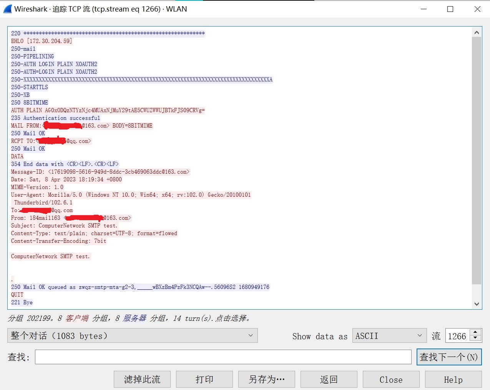

# <center>华东师范大学数据科学与工程学院实验报告</center>

|课程名称:计算机网络与编程 | 年级:22级 | 上机实践成绩: |
| ---- | ---- | ---- |
| 指导教师:张召 | 姓名:郭夏辉 | 学号:10211900416 |
| 上机实践名称:HTTP、SMTP、POP3协议分析 | 上机实践日期:2023年4月7日 | 上机实践编号:No.06 |
| 组号:1-416 | 上机实践时间:2023年4月7日 |      |

------

## 一、实验目的

- 熟悉HTTP协议的工作原理
- 了解HTTP协议在实际网络中的运行过程
- 熟悉SMTP和POP3协议的工作原理
- 了解SMTP和POP3协议在实际网络中的运行过程

## 二、实验任务

- 通过Wireshark分析HTTP协议
- 通过Wireshark分析SMTP和POP3协议

## 三、实验环境

- Intellij IDEA 2022.3.2
- JDK 19

## 四、实验过程

### task1

利用Wireshark抓取一条HTTP请求网络包，分析HTTP请求网络包的组成（要求根据报文结构正确标识每个部分)，请将实验结果附在实验报告中。

首先，我访问了网址: http://www.chinesemooc.org

然后通过ping看到了华文慕课的ip地址: `182.92.233.49`


接着我打开Wireshark抓取相关的HTTP请求网络包如下图所示。注意在Wireshark之中HTTP请求报文会在左侧的标号处标一个向右的箭头，而与之对应的响应报文会标注一个向左的箭头。


HTTP的请求报文格式如下:


然后我具体地对这个报文进行分析:


### task2

利用Wireshark找到上述请求网络包相对应的HTTP响应网络包，然后对比分析两个网络包的组成，请在实验报告中说明两者之间的区别。

通过Task1中的操作，我只需找到Wireshark中与那个请求报文相对应的箭头即可，这便是相对应的响应报文。


HTTP的响应报文格式如下:


然后我具体地对这个报文进行分析:


可以看到这个和请求报文有很多的类似之处，响应头部和请求头部的结构类似，都是字段名:值(回车)(换行);它们的正文部分也是类似的，最明显的差异在于首行不同:

请求报文的首行是请求行，结构是 请求方法(空格)URL(空格)协议版本(回车)(换行)

但是响应报文的首行是状态行，结构是 协议版本(空格)状态码(空格)状态描述(回车)(换行)

### task3

学习了解GET和POST方法，请在实验报告中分析对比GET和POST方法的请求报文，以及GET和POST方法的和响应报文之间的区别。

最首要的任务当然还是先了解GET和POST方法的请求和响应报文之基本格式:


可以看到GET 和 POST 的请求报文结构上类似，但差异在于 GET 请求报文一般没有请求体，数据放在 URL 中；而 POST 请求报文有请求体，要传递的数据一般放在这里。同时GET一般用于从服务器获取资源，但是POST 表示向指定服务器提交数据。GET方法传递的数据量较小，最大不超过2KB（因为受URL长度限制）而Post方法传递的数据量较大，一般不受限制（大小取决于服务器的处理能力）。

还有就是GET会产生一个TCP数据包，浏览器会把Header和Data一并发送出去，服务器响应200（OK），并回传相应的数据。POST方法会产生两个TCP数据包，浏览器会先将Header发送出去，服务器响应100（Continue）后，浏览器再发送数据，服务器响应200（OK），并回传相应的数据。

为了具体的分析，我抓取了一段POST方法的请求报文和响应报文

这是POST方法的请求报文:


这是POST方法的响应报文:


这是GET方法的请求报文作为对比:


### task4

利用Wireshark抓取SMTP和POP3网络包，分析SMTP和POP3数据包组成（要求根据报文结构正确标识每个部分），请将实验结果附在实验报告中。

这个在实践过程中我这里出了一些问题。我用的不是实验操作手册里面讲道德Foxmail邮箱客户端而是自己常用的Thunderbird邮箱客户端。这个要进行一些类似的配置，否则Wireshark里面抓取不到任何报文。


然后就是要注意在163邮箱里面开启SMTP和POP3服务，接着登录我的邮箱后刷新一下我就得到了POP3数据包:（这里为了保护隐私信息，抹去了相关的邮箱地址）


接下来是具体的分析:


STAT返回邮箱里面的邮件数量以及邮件占用的空间大小信息而LIST返回某一封邮件的统计信息.

然后我尝试着用这个邮箱发了一封邮件后略微等一下之后Wireshark中便抓取到了SMTP网络包了:


接下来是具体的分析:


- 220 代表连接 SMTP 服务器成功
- EHLO表明邮件带有身份验证，是没有办法伪造的
- 250表示相关的请求命令完成了
- 221表示连接断开

为了更加深入地了解相关的原理，我上网查阅了SMTP和POP3协议的具体细节和流程。


### task5

利用Wireshark抓取SMTP网络包，分析一个在SMTP客户（C）和SMTP服务器（S）之间交换报文文本的例子（参考书本p77-78)，请将实验结果附在实验报告中.



为了保护隐私，在这里我和上一个task一样隐去了相应的邮箱地址。

```
S:220 163.com(这个看不了具体的，但应该是163.com)
C:EHLO 172.30.204.59
S:Hello 172.30.204.59, pleased to meet you
C:AUTH AG...Vg=
S:235 Authentication successful
C:MAIL FROM:<...@163.com> 
S:250 Mail OK
C:RCPT TO:<...@qq.com>
S:250 Mail OK
C:DATA
S:354 End data with <CR><LF>.<CR><LF>
C:......(邮件内容)
C:.(结束了)
S:250 Mail OK queued as ......
C:QUIT
S:221 Bye
```

## 五、总结

这次实验整体上来说还是比较简单的，我通过抓取网络包并分析、观察其报文，熟悉了 HTTP、SMTP、POP3 的工作原理，明白了GET和POST方法的差异，直观地见识了它们在实际中的运行过程，巩固知识的同时为以后的理论学习和实验打下了坚实基础。
