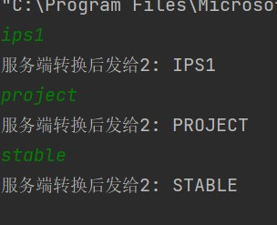
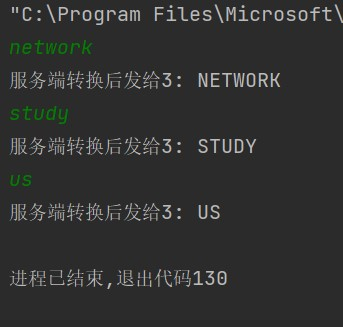
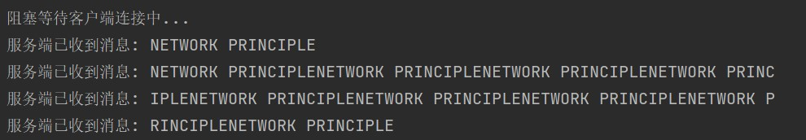
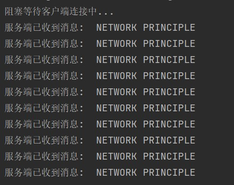

# <center>华东师范大学数据科学与工程学院实验报告</center>

|课程名称:计算机网络与编程 | 年级:22级 | 上机实践成绩: |
| ---- | ---- | ---- |
| 指导教师:张召 | 姓名:郭夏辉 | 学号:10211900416 |
| 上机实践名称:基于TCP的Socket编程 | 上机实践日期:2023年4月14日 | 上机实践编号:No.07 |
| 组号:1-416 | 上机实践时间:2023年4月14日 |      |

------

[TOC]

## 一、实验目的

- 使⽤ServerSocket和Socket实现TCP通信
- 了解粘包概念并尝试解决

## 二、实验任务

- 使⽤ServerSocket和Socket编写代码

- 解决粘包问题


## 三、实验环境

- Intellij IDEA 2022.3.2
- JDK 19

## 四、实验过程

### task1

使⽤Scanner修改TCPClient类，达成如下效果，请将实现代码段及运⾏结果附在实验报告中。

```
 客户端不断读取⽤户控制台输⼊的⼀⾏英⽂字⺟串并将数据发送给服务器
 服务器将收到的字符全部转换为⼤写字⺟，服务器将修改后的数据发送给客户端
 客户端收到修改后的数据，并在其屏幕上显示
```

这个task应该是简单的，但是自己还是碰到了几个小问题。根据实验手册，在理解了`TCPServer`和`TCPClient`类的功能与实现之后，我先修改的是`TCPClient`中的代码，这里别忘了在最初导入相关的库。`import java.util.Scanner;`

根据前面的project对Java基础知识所学，我很容易地写出了对应的代码(完整代码见附录):

```java
	int port = 9091;
        TCPClient client = new TCPClient();
        try {
            client.startConnection("127.0.0.1", port);
            String response;
            Scanner sc = new Scanner(System.in);
            while(sc.hasNext()){
                String tmp = sc.next();
                response=client.sendMessage(tmp);
                System.out.println(response);
            }
        }catch (IOException e){
            e.printStackTrace();
        }finally {
            client.stopConnection();
        }
```

然后完成`TCPServer`中的对应代码(完整代码见附录):

```java
String str;
        try{
            while((str=in.readLine())!=null){
                System.out.println("我是服务端，客户端说： " + str);

                // 消息回写
                out.println("服务端转换后" + str.toUpperCase());
            }
        }catch (IOException e){
            e.printStackTrace();
        }
```

完成代码之后，如果先运行客户端再运行服务端就会报错:


这在逻辑上是正确的:如果服务端没有打开，客户端怎么连接呢？

客户端上的运行结果:


服务端的运行结果:


可以看到，虽然前面是正确的，但是在终止时却出现了明显的错误，这个应该怎么修改呢？我的修改方案是去修改服务端的代码，一起使用Scanner,使其与客户端的输入对应起来，这样就可以解决这个报错了(完整代码见附录):

```java
Scanner sc = new Scanner(in);
        String str;
        while(sc.hasNext()){
            str=sc.next();
            System.out.println("我是服务端，客户端说： " + str);
            out.println("服务器端转换后" + str.toUpperCase());
        }
```

修改之后就好了:


### task2

修改代码使得每⼀次accept()的Socket都被⼀个线程接管，同时接管的逻辑保留Task1的功能，开启⼀个服务端和三个客户端进⾏测试，请将实现代码段及运⾏结果附在实验报告中。

完成这个task需要我结合之前学过的Java多线程相关的知识。在task1中，我完成的是单服务端单客户端的通信，这显然是理想的——实际过程中我们碰到的主要是单服务端多客户端甚至多服务端多客户端。对于服务端的每个工作线程而言，他们各自执行某一个客户端的事务，互不干扰地并发执行。在这里我碰到一个问题，就是既然每个线程之间不能发生干扰，但是来自task1之中的`TCPServer`类的I/O（即`in`和`out`）却被它的线程`ClientHandler`所共享，这样就会在实际过程中出现很诡异的问题。我们知道每个线程拥有独立的局部变量，那么我们是否可以将`in`和`out`设为`ClientHandler`的局部变量呢？实际过程中发现这是可以的。还有就是既然socket是OS提供给我们的通过TCP/IP协议栈进⾏⼀整套建⽴连接、发送数据，断开连接的过程的接⼝，那么在交给对应的线程工作时只用传递对应的socket就可以了.(完整代码见附录)

对`accept()`监听端口的修改:

```java
        int k=0;
        while(true){
            System.out.println("阻塞等待客户端连接中...");
            clientSocket = serverSocket.accept();
            ClientHandler tcpServerThread = new ClientHandler(clientSocket,k);
            tcpServerThread.start();
            k++;
        }
```

对`ClientHandler`的完善:

```java
    public class ClientHandler extends Thread {
        int threadnum;
        private Socket clientSocket;
        PrintWriter out;
        BufferedReader in;

        public ClientHandler(Socket clientSocket,int k){
            this.clientSocket=clientSocket;
            this.threadnum=k;
        }
        @Override
        public void run(){
            try{
                out = new PrintWriter(new OutputStreamWriter(clientSocket.getOutputStream(),
                        StandardCharsets.UTF_8), true);
                in = new BufferedReader(new InputStreamReader(clientSocket.getInputStream(),
                        StandardCharsets.UTF_8));
                Scanner sc = new Scanner(in);
                String str;
                while(sc.hasNext()){
                    str=sc.next();
                    System.out.println("我是服务端，客户端"+String.valueOf(threadnum)+"说: "+ str);
                    out.println("服务端转换后发给" +String.valueOf(threadnum)+": "+ str.toUpperCase());
                }

            }catch(IOException e){
                System.out.println("连接异常断开");
            }
        }
        public void STOP(){
            try {
                if(in!=null) in.close();
                if(out!=null) out.close();
                if(clientSocket!=null) clientSocket.close();
                if(serverSocket!=null) serverSocket.close();
            }catch (IOException e){
                e.printStackTrace();
            }
        }
        public void main(String[] args){
            try{
                this.run();
            }finally {
                this.STOP();
            }
        }
    }
```


然后在实际运行时，为了在IDEA中配置多实例运行，我这里需要写一个配置文件:


然后在运行前选中相关的配置文件:


客户端的运行结果:






服务端的运行结果:


可以看到输出了预期的结果

### task3

查阅资料，总结半包粘包产⽣的原因以及相关解决⽅案，尝试解决以上代码产⽣的半包粘包问题，将修改代码和解决思路附在实验报告中。

TCP 传输中，客户端发送数据，本质是把数据写入到了 TCP 的缓存中，半包粘包现象在此时产生。

- 粘包问题

假如客户端发送的包的大小比 TCP的缓存容量小，这样 TCP 缓存可以存放多个包，之后客户端与服务端的一次通信就可能传递了多个包，这时候服务端从 TCP 缓存也一次性读取了多个包，这种现象就叫粘包。

- 半包问题

如果客户端发送的包的大小比 TCP 的缓存容量大，那么这个包就会被分成多个小的包，通过 Socket 多次发送到服务端，服务端第一次从接受缓存里面获取的数据，实际是整个包的一部分，这时候就出现了半包问题。

我们来通过示意图来看一下这两种现象发生的原因:

首先，如果我试图从客户端向服务端发送两个数据包，理想的状况下服务端依次接收到这两个包，并且分别处理，如下图所示：


但 TCP 是一个面向字节流的协议，它是性质是流式的，所以它并不会对我发出的两个数据包进行硬性的分段，如下图所示，两个数据包被合并在一起送到了服务端，服务端若按第一个包的逻辑来处理则会出错。


即使他们没有被合并在一个包中，也有可能出现两个包的内容互相包含，或是一个包的信息被另一个包提前发送了。这对于服务端来说依然无法解析，正如下图所示。


- 解决半包粘包问题的方法

(1) 固定消息长度: 把消息设置为固定长度即可，如果数据不够，空位补空格。优点就是实现很简单方便操作，缺点是在连续发送短信息时空间会产生大量浪费。 

(2) 使用分隔符: 用一个分隔符来确定消息边界。优点是空间不浪费，实现也相对简单。缺点是当内容本身出现分割符时需要转义处理，所以无论是 Client 端发送时还是 Server 端接收时，都需要对所有数据进行扫描，降低了传输效率。 

(3) 把 TCP 连接形式改成短连接: 每次进行传输就启动一个短连接。这样的话按逻辑传递的信息就有了边界。但缺点也就很明显，每次传递消息都要进行三次握手过程重新建立连接，会浪费大量时间用在建立连接上，降低了传输效率。

 (4) 采用变长协议: 将消息区分为消息头和消息体，在消息头中，使用一个整形数字，如一个 int，来表示消息体的长度，执行该协议时发送方在发送数据之前，需要先获取需要发送内容的二进制字节大小， 然后在需要发送的内容前面添加一个整数，表示消息体二进制字节的长度。接收方在解析时，先读取内容长度，其值为实际消息体内容占用的字节数，之后必须读取到这么多字节的内容，才认为是一个完整的数据报文。

看完了理论，让我结合实际来解决一下本次实验的指南中半包粘包问题吧。



为了解决半包粘包问题，我采用的是使用固定的消息长度。在客户端发送消息时，它会将消息转换为字节数组，并计算该字节数组的长度，最后将长度字节数组和消息字节数组写入输出流。

而服务端先从输入流中读取前四个字节，这四个字节包含了接下来消息的长度。服务端再读取长度值指定的字节数，并将它们组合成一个完整的消息。

通过这样的方法，接收方可以预先知道消息的长度，从而可以正确地解析每个消息，而不会因为缺少字节或多余字节而出现错误。

TCPServer添加的代码

```java
    private int byteArrayToInt(byte[] bytes) {
        ByteBuffer buffer = ByteBuffer.wrap(bytes);
        return buffer.getInt();
    }
```

TCPServer修改的代码

```java
        for (;;) {
            byte[] lengthBytes = new byte[4];
            int bytesRead = is.read(lengthBytes, 0, 4);
            if (bytesRead < 0) break;
            int messageLength = byteArrayToInt(lengthBytes);
            byte[] messageBytes = new byte[messageLength];
            bytesRead = is.read(messageBytes, 0, messageLength);
            if (bytesRead < 0) break;
            String message = new String(messageBytes);
            System.out.println("服务端已收到消息:  " + message);
        }
```

TCPClient修改的代码

```java
    private byte[] intToByteArray(int value) {
        return new byte[] {
                (byte)(value >>> 24),
                (byte)(value >>> 16),
                (byte)(value >>> 8),
                (byte)value
        };
    }
```

```java
    public void sendMessage(String msg) throws IOException {
        for(int i=0;i<10;i++){
            byte[] messageBytes = msg.getBytes();
            int messageLength = messageBytes.length;
            byte[] lengthBytes = intToByteArray(messageLength);
            out.write(lengthBytes);
            out.write(messageBytes);
            out.flush();
        }
    }
```

感觉主要添加的就是一个转化和还原的过程。

经过修改，半包粘包问题终于解决了:



------

#### 附录

##### task1的TCPClient类

```java
import java.io.*;
import java.net.Socket;
import java.nio.charset.StandardCharsets;


import java.util.Scanner;

public class TCPClient {
    private Socket clientSocket;
    private PrintWriter out;
    private BufferedReader in;
    public void startConnection(String ip, int port) throws IOException {
// 1. 创建客户端Socket，指定服务器地址，端⼝
        clientSocket = new Socket(ip, port);
// 2. 获取输⼊输出流
        out = new PrintWriter(new OutputStreamWriter(clientSocket.getOutputStream(),
                StandardCharsets.UTF_8), true);
        in = new BufferedReader(new InputStreamReader(clientSocket.getInputStream(),
                StandardCharsets.UTF_8));
    }
    public String sendMessage(String msg) throws IOException {
// 3. 向服务端发送消息
        out.println(msg);
// 4. 接收服务端回写信息
        String resp = in.readLine();
        return resp;
    }
    public void stopConnection() {
// 关闭相关资源
        try {
            if(in!=null) in.close();
            if(out!=null) out.close();
            if(clientSocket!=null) clientSocket.close();
        } catch (IOException e){
            e.printStackTrace();
        }
    }
    public static void main(String[] args) {
        int port = 9091;
        TCPClient client = new TCPClient();
        try {
            client.startConnection("127.0.0.1", port);
            String response;
            Scanner sc = new Scanner(System.in);
            while(sc.hasNext()){
                String tmp = sc.next();
                response=client.sendMessage(tmp);
                System.out.println(response);
            }

        }catch (IOException e){
            e.printStackTrace();
        }finally {
            client.stopConnection();
        }
    }
}
```

##### task1的TCPServer类

最终版

```java
import java.io.*;
import java.net.ServerSocket;
import java.net.Socket;
import java.nio.charset.StandardCharsets;

import java.util.Scanner;

public class TCPServer {
    private ServerSocket serverSocket;
    private Socket clientSocket;
    private PrintWriter out;
    private BufferedReader in;
    public void start(int port) throws IOException {
        // 1. 创建⼀个服务器端Socket，即ServerSocket，监听指定端⼝
        serverSocket = new ServerSocket(port);
        // 2. 调⽤accept()⽅法开始监听，阻塞等待客户端的连接
        System.out.println("阻塞等待客户端连接中...");
        clientSocket = serverSocket.accept();
        // 3. 获取Socket的字节输出流
        out = new PrintWriter(new OutputStreamWriter(clientSocket.getOutputStream(),
                StandardCharsets.UTF_8), true);
        // 4. 获取Socket的字节输⼊流，并准备读取客户端发送的信息
        in = new BufferedReader(new InputStreamReader(clientSocket.getInputStream(),
                StandardCharsets.UTF_8));

        Scanner sc = new Scanner(in);
        String str;
        while(sc.hasNext()){
            str=sc.next();
            System.out.println("我是服务端，客户端说： " + str);
            out.println("服务器端转换后" + str.toUpperCase());
        }
    }
    public void stop(){
// 关闭相关资源
        try {
            if(in!=null) in.close();
            if(out!=null) out.close();
            if(clientSocket!=null) clientSocket.close();
            if(serverSocket!=null) serverSocket.close();
        }catch (IOException e){
            e.printStackTrace();
        }
    }
    public static void main(String[] args) {
        int port = 9091;
        TCPServer server=new TCPServer();
        try {
            server.start(port);
        }catch (IOException e){
            e.printStackTrace();
        }finally {
            server.stop();
        }
    }
}
```

##### task2中的TCPServer类

```java
import java.io.*;
import java.net.ServerSocket;
import java.net.Socket;
import java.nio.charset.StandardCharsets;

import java.util.Scanner;

public class TCPServer {
    private ServerSocket serverSocket;
    private Socket clientSocket;

    public void start(int port) throws IOException {
// 1. 创建⼀个服务器端Socket，即ServerSocket，监听指定端⼝
        serverSocket = new ServerSocket(port);
// 2. 调⽤accept()⽅法开始监听，阻塞等待客户端的连接
        int k=0;
        while(true){
            System.out.println("阻塞等待客户端连接中...");
            clientSocket = serverSocket.accept();
            ClientHandler tcpServerThread = new ClientHandler(clientSocket,k);
            tcpServerThread.start();
            k++;
        }
    }

    public class ClientHandler extends Thread {
        int threadnum;
        private Socket clientSocket;
        PrintWriter out;
        BufferedReader in;

        public ClientHandler(Socket clientSocket,int k){
            this.clientSocket=clientSocket;
            this.threadnum=k;
        }
        @Override
        public void run(){
            try{
                out = new PrintWriter(new OutputStreamWriter(clientSocket.getOutputStream(),
                        StandardCharsets.UTF_8), true);
                in = new BufferedReader(new InputStreamReader(clientSocket.getInputStream(),
                        StandardCharsets.UTF_8));
                Scanner sc = new Scanner(in);
                String str;
                while(sc.hasNext()){
                    str=sc.next();
                    System.out.println("我是服务端，客户端"+String.valueOf(threadnum)+"说: "+ str);
                    out.println("服务端转换后发给" +String.valueOf(threadnum)+": "+ str.toUpperCase());
                }

            }catch(IOException e){
                System.out.println("连接异常断开");
            }
        }
        public void STOP(){
            try {
                if(in!=null) in.close();
                if(out!=null) out.close();
                if(clientSocket!=null) clientSocket.close();
                if(serverSocket!=null) serverSocket.close();
            }catch (IOException e){
                e.printStackTrace();
            }
        }
        public void main(String[] args){
            try{
                this.run();
            }finally {
                this.STOP();
            }
        }
    }

    public static void main(String[] args) {
        int port = 9091;
        TCPServer server=new TCPServer();
        try {
            server.start(port);
        }catch (IOException e){
            e.printStackTrace();
        }
    }
}
```

##### task3修改后的代码

```java
import java.io.*;
import java.net.ServerSocket;
import java.net.Socket;
import java.nio.ByteBuffer;

public class TCPServer {
    private ServerSocket serverSocket;
    private Socket clientSocket;
    private static int BYTE_LENGTH = 64;

    public void start(int port) throws IOException {
        serverSocket = new ServerSocket(port);
        System.out.println("阻塞等待客户端连接中...");
        clientSocket = serverSocket.accept();
        InputStream is = clientSocket.getInputStream();
        for (;;) {
            byte[] lengthBytes = new byte[4];
            int bytesRead = is.read(lengthBytes, 0, 4);
            if (bytesRead < 0) break;
            int messageLength = byteArrayToInt(lengthBytes);
            byte[] messageBytes = new byte[messageLength];
            bytesRead = is.read(messageBytes, 0, messageLength);
            if (bytesRead < 0) break;
            String message = new String(messageBytes);
            System.out.println("服务端已收到消息:  " + message);
        }
    }

    public void stop() {
        try {
            if (clientSocket != null) clientSocket.close();
            if (serverSocket != null) serverSocket.close();
        } catch (IOException e) {
            e.printStackTrace();
        }
    }

    private int byteArrayToInt(byte[] bytes) {
        ByteBuffer buffer = ByteBuffer.wrap(bytes);
        return buffer.getInt();
    }

    public static void main(String[] args) {
        int port = 9091;
        TCPServer server = new TCPServer();
        try {
            server.start(port);
        } catch (IOException e) {
            e.printStackTrace();
        } finally {
            server.stop();
        }
    }
}

```

```java
import java.io.*;
import java.net.Socket;

public class TCPClient {
    private Socket clientSocket;
    private OutputStream out;

    public void startConnection(String ip, int port) throws IOException {
        clientSocket = new Socket(ip, port);
        out = clientSocket.getOutputStream();
    }

    public void sendMessage(String msg) throws IOException {
        for(int i=0;i<10;i++){
            byte[] messageBytes = msg.getBytes();
            int messageLength = messageBytes.length;
            byte[] lengthBytes = intToByteArray(messageLength);
            out.write(lengthBytes);
            out.write(messageBytes);
            out.flush();
        }
    }

    public void stopConnection() {
        try {
            if (out != null) out.close();
            if (clientSocket != null) clientSocket.close();
        } catch (IOException e) {
            e.printStackTrace();
        }
    }

    private byte[] intToByteArray(int value) {
        return new byte[] {
                (byte)(value >>> 24),
                (byte)(value >>> 16),
                (byte)(value >>> 8),
                (byte)value
        };
    }

    public static void main(String[] args) {
        int port = 9091;
        TCPClient client = new TCPClient();
        try {
            client.startConnection("127.0.0.1", port);
            String message = "NETWORK PRINCIPLE";
            client.sendMessage(message);
        } catch (IOException e) {
            e.printStackTrace();
        } finally {
            client.stopConnection();
        }
    }
}
```

## 五、总结

本次实验的难度不算大，在结合之前所学知识的同时通过有趣的Socket编程，我对计算机网络中的应用层有了更深刻的认识。socket提供的接口是强大的，希望我能好好利用，掌握计算机网络的奥秘。
