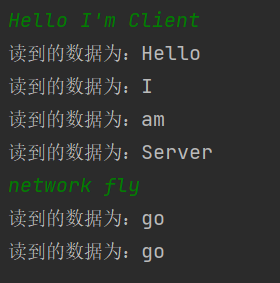
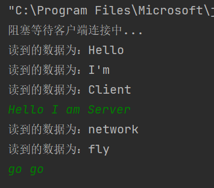
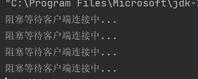
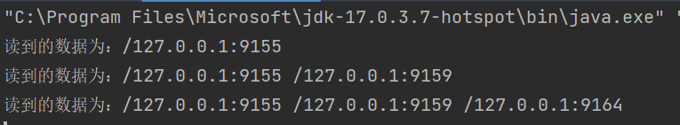
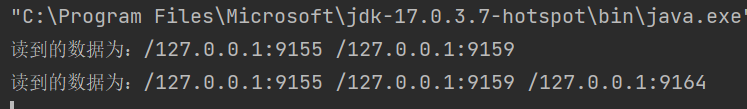
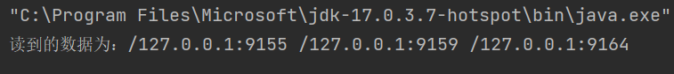
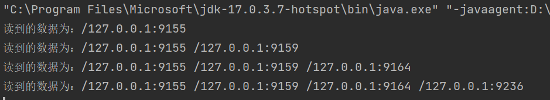
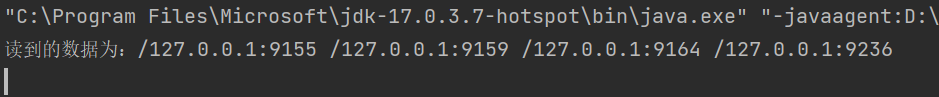
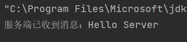
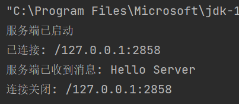

# <center>华东师范大学数据科学与工程学院实验报告</center>

|课程名称:计算机网络与编程 | 年级:22级 | 上机实践成绩: |
| ---- | ---- | ---- |
| 指导教师:张召 | 姓名:郭夏辉 | 学号:10211900416 |
| 上机实践名称:基于TCP的Socket编程优化 | 上机实践日期:2023年4月21日 | 上机实践编号:No.08 |
| 组号:1-416 | 上机实践时间:2023年4月21日 |      |

------


## 一、实验目的

- 对数据发送和接收进⾏优化 
- 实现信息共享
- 熟悉阻塞I/O与⾮阻塞I/O

## 二、实验任务

- 将数据发送与接收并⾏，实现全双⼯通信 
- 实现服务端向所有客户端⼴播消息 
- 了解⾮阻塞I/O


## 三、实验环境

- Intellij IDEA 2022.3.2
- JDK 19

## 四、实验过程

### task1

继续修改TCPClient类，使其发送和接收并⾏，达成如下效果，当服务端和客户端建⽴连接后，⽆论是服务端还是客户端均能随时从控制台发送消息、将接收的信息打印在控制台，将修改后的TCPClient代码附在实验报告中，并展示运⾏结果。

我的主体思路是根据实验指导文档给出的代码，模仿服务器，去实现了客户端相应的读写操作。

#### ServerHandler

```java
import java.io.*;
import java.net.Socket;
import java.nio.charset.StandardCharsets;
class ServerHandler extends Thread {
    private Socket socket;
    private final ServerReadHandler serverReadHandler;
    private final ServerWriteHandler serverWriteHandler;
    ServerHandler(Socket socket) throws IOException{
        this.socket = socket;
        this.serverReadHandler = new ServerReadHandler(socket.getInputStream());
        this.serverWriteHandler = new ServerWriteHandler(socket.getOutputStream());
    }
    @Override
    public void run() {
        super.run();
        serverWriteHandler.start();
        serverReadHandler.start();
    }
}
```

#### ServerReadHandler

```java
// 处理从服务器读数据的线程
import java.io.*;
import java.net.Socket;
import java.nio.charset.StandardCharsets;
class ServerReadHandler extends Thread {
    private final BufferedReader bufferedReader;
    ServerReadHandler(InputStream inputStream) {
        this.bufferedReader = new BufferedReader(new InputStreamReader(inputStream,
                StandardCharsets.UTF_8));
    }
    @Override
    public void run() {
        try {
            while (true) {
                // 拿到服务器⼀条数据
                String str = bufferedReader.readLine();
                if (str == null) {
                    System.out.println("读到的数据为空");
                    break;
                } else {
                    System.out.println("读到的数据为：" + str);
                }
            }
        } catch (IOException e) {
            e.printStackTrace();
        }
    }
}

```

#### ServerWriteHandler

```java
// 处理从服务器写数据的线程
import java.io.*;
import java.net.Socket;
import java.util.Scanner;
import java.nio.charset.StandardCharsets;
class ServerWriteHandler extends Thread {
    private final PrintWriter printWriter;
    private final Scanner sc;
    ServerWriteHandler(OutputStream outputStream) {
        this.printWriter = new PrintWriter(new OutputStreamWriter(outputStream),
                true);
        this.sc = new Scanner(System.in);
    }
    void send(String str){
        this.printWriter.println(str);
    }
    @Override
    public void run() {
        while (sc.hasNext()) {
            // 拿到控制台数据
            String str = sc.next();
            send(str);
        }
    }
}

```

#### TCPClient

最后就是要完善一下TCPClient了呢，我最开始把相应的serverHandler对象的执行放到了一个while(true)循环里（结合TCPServer）,但是这样就卡住了，没有任何效果。在确认了自己的代码没什么逻辑问题之后，我删去了相应的while循环，就正常了。

还有个自己碰到的问题就是端口的问题，由于本地使用了相关的代理软件，导致用到的端口被占用了，这也出现了报错无法运行的情况。

```java
import java.io.*;
import java.net.Socket;
import java.nio.charset.StandardCharsets;
import java.util.Scanner;

public class TCPClient {
    private Socket clientSocket;

    public void start(String ip, int port) throws IOException {
        clientSocket = new Socket(ip, port);
        ServerHandler serverHandler = new ServerHandler(clientSocket);
        serverHandler.start();
    }

    public static void main(String[] args) {
        int port = 9091;
        TCPClient client = new TCPClient();
        try {
            client.start("127.0.0.1", port);
        }catch (IOException e){
            e.printStackTrace();
        }
    }
}
```

#### 运行结果

客户端



服务器



### task2

修改TCPServer和TCPClient类，达成如下效果，每当有新的客户端和服务端建⽴连接后，服务端向当前所有建⽴连接的客户端发送消息，消息内容为当前所有已建⽴连接的Socket对象getRemoteSocketAddress() 的集合，请测试客户端加⼊和退出的情况，将修改后的代码附在实验报告中，并展示运⾏结果。

为了获取要发送的信息内容，我们需要记录下Socket；

为了向当前所有已经建立连接的客户端发送消息，我们需要记录所有的ClientHandler。

所以，我们要在服务器中建立两个数组分别存放它们，存放的操作只需要在监听到相应的客户端后添加到对应的数组就行了。

#### TCPServer

实例运行的主体部分如下所示，和我在上面说的思路差不多:

```java
    public void start(int port) throws IOException {
        serverSocket = new ServerSocket(port);
        while(true){
            System.out.println("阻塞等待客户端连接中...");
            Socket clientSocket = serverSocket.accept();
            sockets.add(clientSocket);
            ClientHandler clientHandler = new ClientHandler(clientSocket);
            handlers.add(clientHandler);
            clientHandler.start();
            String msg = getSocketAddresses();
            for (ClientHandler ch : handlers){
                ch.send(msg);
            }
        }

    }
```

然后就是要在ClientHandler类中添加send函数:(因为clientWriteHandler是private修饰的，只能通过这样的方式调用)

```java
    public void send(String msg){
        this.clientWriteHandler.send(msg);
    }
```

接下来就是要完善TCPServer中的getSocketAddresses方法:

```java
    public String getSocketAddresses() {
        StringBuilder stringBuilder = new StringBuilder();
        for (Socket socket : sockets) {
            stringBuilder.append(socket.getRemoteSocketAddress() + " ");
        }
        return stringBuilder.toString();
    }
```

在这里我碰到一个问题，就是如果用String类型是不行的。在查阅了一些资料后，我发现了原因——发送的内容是所有已建立连接的Socket对象调用getRemoteSocketAddress()方法后拼接起来的，这个字符串不是静态的，而是动态变化着的，使用StringBuilder可以解决相关的问题，当然最后要转换为String（为了便于输出）。

经过以上的修改，就基本可以满足实验的要求了，TCPClient在这里还是延续着task1中的了，没有特别的修改。

#### 运行结果

我先一次性地运行了3个TCPClient(TCPServer开启了一个的情况下)：

TCPServer:



最早打开的TCPClient:



稍后打开的TCPClient:



最后打开的TCPClient:



然后关闭最后和稍后打开的客户端,并新打开了一个客户端:

最原始的客户端:



最新的客户端:



可以看到与预期结果一致。

### task3

尝试运⾏NIOServer并运⾏TCPClient，观察TCPServer和NIOServer的不同之处，并说明当有并发的1万个客户端(C10K)想要建⽴连接时，在Lab7中实现的TCPServer可能会存在哪些问题。

在运行NIOServer和TCPServer之后，我发现的不同点：

1.NIOServer的accept()可以设置为非阻塞模式，读取客户端发来的信息也不用等待。在不开启多线程的情况下，就可以实现并发通信，每次循环都监听一下，如果有客户端则连接，没有就继续运行。而且，NIOServer 使用了 select()轮流询问的方式，可以同时监听多个通道的读写事件。

2.TCPServer的accept()是阻塞型的，读取客户端发来的信息需要等待。我们需要创建多个线程才能并发地与多个客户端连接并通信。而且，TCPServer 只能在一个通道上进行I/O操作。

按照lab7的TCPServer的实现，每当有一个客户端建立连接时，就要新建一个ClientHandler线程来处理，当并发量超过一万之后，创建线程数将会超过一万，会导致系统调度负担难以承受，降低系统吞吐量的同时，服务器的线程资源轻易地就被消耗完了。

### task4

尝试运⾏上⾯提供的NIOServer，试猜测该代码中的I/O多路复⽤调⽤了你操作系统中的哪些API，并给出理由。

我猜测调用了如下的API:

- Selector.open() ：调用了epolll_create系统调用，会创建一个Selector对象，用于监听。 
- serverSocket.configureBlocking(false)/channel.configureBlocking(false) ：利用fcntl系统调用，分别将ServerSocketChannel和SocketChannel设置为非阻塞模式，而 fcntl系统调用设置了文件描述符的相关属性。
- selector.select() ：调用了 epoll_wait 系统调用，等待epoll_wait返回来检测是否有I/O 事件已经就绪。
-  selectionKey.isReadable/isWritable() ：判断是否可以读/写。判断文件读写权限离不开对系统相关函数的调用。 
- channel.read(buffer)/channel.write(buffer) ：从Channel中读/写数据。根据名字进行推测，这两个函数最终会在系统中调用read和write这样的系统API实现相应的读/写操作。

### task5(Bonus)

编写基于NIO的NIOClient，当监听到和服务器建⽴连接后向服务端发送"Hello Server"，当监听到可读时将服务端发送的消息打印在控制台中。（⾃⾏补全NIOServer消息回写）

#### NIOServer

这个代码其实和给到的代码类似，就只需要补全一个消息回写功能就行了。（完整代码见附录）

这个注意相关的格式要求，在最后加一行代码就行了。

```java
channel.write(ByteBuffer.wrap(("服务端已收到消息：" + new String(data)).getBytes()));
```

#### NIOClient

这个的实现注意入乡随俗，就是相应的函数调用参数要对应起来写好了，然后就是仿照着些就行。

```java
import java.io.IOException;
import java.net.InetSocketAddress;
import java.nio.ByteBuffer;
import java.nio.channels.SocketChannel;
import java.nio.charset.StandardCharsets;
public class NIOClient {
    private SocketChannel channel;
    public void start(String ip, int port) throws IOException {
        this.channel = SocketChannel.open();
        channel.connect(new InetSocketAddress(ip,port));
        channel.write(ByteBuffer.wrap("Hello Server".getBytes()));
        ByteBuffer buffer = ByteBuffer.allocate(64);
        System.out.println(new String(buffer.array(),0, channel.read(buffer), StandardCharsets.UTF_8));
        channel.close();
    }
    public static void main(String[] args) {
        NIOClient NIOclient = new NIOClient();
        try {
            NIOclient.start("127.0.0.1",9091);
        }catch (IOException e) {
            e.printStackTrace();
        }
    }
}
```

#### 运行结果

NIOClient



NIOServer



## 五、总结

本次实验还是颇有难度的，我在很细节的问题上调试了很久很久。在结合着实验手册和网上资料的基础上，我对发送和接受并行终于有了一个更深的理解，从Lab7的半双工通信进化到了如今的全双工通信;同时，我也了解了阻塞与非阻塞型的I/O，学习、模仿、实践NIO的相关功能，结合着它与TCP通信的区别和联系，对网络通信的认识更上一层楼。

## 六、附录

#### task2的TCPServer完整代码

```java
import java.io.*;
import java.net.ServerSocket;
import java.net.Socket;
import java.util.*;
import java.nio.charset.StandardCharsets;

public class TCPServer {
    private ServerSocket serverSocket;
    private List<Socket> sockets = new ArrayList<Socket>();
    private List<ClientHandler> handlers = new ArrayList<ClientHandler>();

    public void start(int port) throws IOException {
        serverSocket = new ServerSocket(port);
        while(true){
            System.out.println("阻塞等待客户端连接中...");
            Socket clientSocket = serverSocket.accept();
            sockets.add(clientSocket);
            ClientHandler clientHandler = new ClientHandler(clientSocket);
            handlers.add(clientHandler);
            clientHandler.start();
            String msg = getSocketAddresses();
            for (ClientHandler ch : handlers){
                ch.send(msg);
            }
        }

    }
    public String getSocketAddresses() {
        StringBuilder stringBuilder = new StringBuilder();
        for (Socket socket : sockets) {
            stringBuilder.append(socket.getRemoteSocketAddress() + " ");
        }
        return stringBuilder.toString();
    }

    public void stop(){
// 关闭相关资源
        try {
            if(serverSocket!=null) serverSocket.close();
        }catch (IOException e){
            e.printStackTrace();
        }
    }
    public static void main(String[] args) {
        int port = 9091;
        TCPServer server=new TCPServer();
        try {
            server.start(port);
        }catch (IOException e){
            e.printStackTrace();
        }finally {
            server.stop();
        }
    }
}
```

#### task5的NIOServer完整代码

```java
import java.io.IOException;
import java.net.InetSocketAddress;
import java.net.Socket;
import java.net.SocketAddress;
import java.nio.ByteBuffer;
import java.nio.channels.SelectionKey;
import java.nio.channels.Selector;
import java.nio.channels.ServerSocketChannel;
import java.nio.channels.SocketChannel;
import java.util.Iterator;
import java.util.Set;
public class NIOServer {
    private static int BYTE_LENGTH = 64;
    private Selector selector;

    public static void main(String[] args) throws IOException {
        try {
            new NIOServer().startServer();
        } catch (IOException e) {
            e.printStackTrace();
        }
    }

    private void startServer() throws IOException {
        this.selector = Selector.open();
// ServerSocketChannel与serverSocket类似
        ServerSocketChannel serverSocket = ServerSocketChannel.open();
        serverSocket.socket().bind(new InetSocketAddress(9091));
// 设置⽆阻塞
        serverSocket.configureBlocking(false);
// 将channel注册到selector
        serverSocket.register(this.selector, SelectionKey.OP_ACCEPT);
        System.out.println("服务端已启动");
        for (; ; ) {
// 操作系统提供的⾮阻塞I/O
            int readyCount = selector.select();
            if (readyCount == 0) {
                continue;
            }
// 处理准备完成的fd
            Set<SelectionKey> readyKeys = selector.selectedKeys();
            Iterator iterator = readyKeys.iterator();
            while (iterator.hasNext()) {
                SelectionKey key = (SelectionKey) iterator.next();
                iterator.remove();
                if (!key.isValid()) {
                    continue;
                }
                if (key.isAcceptable()) {
                    this.accept(key);
                } else if (key.isReadable()) {
                    this.read(key);
                } else if (key.isWritable()) {
                }
            }
        }
    }
    private void accept(SelectionKey key) throws IOException {
        ServerSocketChannel serverChannel = (ServerSocketChannel) key.channel();
        SocketChannel channel = serverChannel.accept();
        channel.configureBlocking(false);
        Socket socket = channel.socket();
        SocketAddress remoteAddr = socket.getRemoteSocketAddress();
        System.out.println("已连接: " + remoteAddr);
// 监听读事件
        channel.register(this.selector, SelectionKey.OP_READ);
    }

    private void read(SelectionKey key) throws IOException {
        SocketChannel channel = (SocketChannel) key.channel();
        ByteBuffer buffer = ByteBuffer.allocate(BYTE_LENGTH);
        int numRead = -1;
        numRead = channel.read(buffer);
        if (numRead == -1) {
            Socket socket = channel.socket();
            SocketAddress remoteAddr = socket.getRemoteSocketAddress();
            System.out.println("连接关闭: " + remoteAddr);
            channel.close();
            key.cancel();
            return;
        }
        byte[] data = new byte[numRead];
        System.arraycopy(buffer.array(), 0, data, 0, numRead);
        System.out.println("服务端已收到消息: " + new String(data));

        channel.write(ByteBuffer.wrap(("服务端已收到消息：" + new String(data)).getBytes()));
    }
}
```


