# <center>华东师范大学数据科学与工程学院实验报告</center>

|课程名称:计算机网络与编程 | 年级:22级 | 上机实践成绩: |
| ---- | ---- | ---- |
| 指导教师:张召 | 姓名:郭夏辉 | 学号:10211900416 |
| 上机实践名称:基于UDP的Socket编程 | 上机实践日期:2023年5月5日 | 上机实践编号:No.09 |
| 组号:1-416 | 上机实践时间:2023年5月5日 |      |

------


## 一、实验目的

- 学习使⽤Datagram Socket实现UDP通信

## 二、实验任务

- 使⽤DatagramSocket和DatagramPacket编写代码


## 三、实验环境

- Intellij IDEA 2022.3.2
- JDK 19

## 四、实验过程

### task1

完善UDPProvider和UDPSearcher，使得接受端在接受到发送端发送的信息后，将该信息向发送端回写，发送端将接收到的信息打印在控制台上，将修改后的代码和运⾏结果附在实验报告中.

在实验手册的代码基础之上，我们需要给UDPProvider，UDPSearcher分别添加回传数据，对回传的数据接受并现实的功能。这个其实是比较简单的，只需要仿照相关的代码即可。

以下列出了相关类要添加的代码(完整代码见附录)

#### UDPProvider

在这里要注意回传数据的类型，不能直接用那个String，而是要先转化为byte类型的数组再进行传输。还有个问题就是要留意端口，在这里我的逻辑是将数据回传给那个发送数据的DatagramSocket对象，然后这个在解析数据环节中那个对包的解析其实就可以获得那个发送的对象所在的端口(就存在port中了，是9092而不是9091).

```java
        byte[] sendBackData = data.getBytes();
        DatagramPacket sendBackPacket = new DatagramPacket(sendBackData, 0,sendBackData.length, InetAddress.getLocalHost(), port);
        datagramSocket.send(sendBackPacket);
```

#### UDPSearcher

与UDPProvider类似，只用写清楚相应的接受部分就好了。

```java
byte[] buf = new byte[1024];
        DatagramPacket receiveBackPacket = new DatagramPacket(buf, 0, buf.length);
        datagramSocket.receive(receiveBackPacket);
        String receiveBackString = new String(receiveBackPacket.getData(), 0, receiveBackPacket.getLength());
        System.out.println("我是接受者，我已经收到了回传的消息:"+ receiveBackString);
```

#### 运行结果

UDPProvider

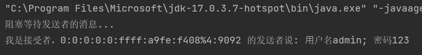

在这里我注意到了自己这里显示的ip地址比较奇怪，`0:0:0:0:0:ffff:a9fe:f408%4`是一个ipv6地址，经过转换，是`169.254.244.8`（这是像192.168.1.1那样的保留地址）

UDPSearcher

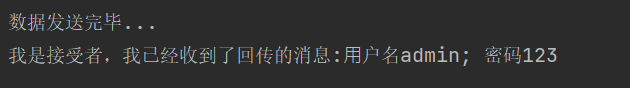

### task2

改写UDPProvider和UDPSearcher代码完成以下功能，并将实验结果附在实验报告中：

```
⼴播地址：255.255.255.255
现需要设计完成如下场景：
 UDPSearcher将UDP包发送⾄⼴播地址的9091号端⼝（这表示该UDP包将会被⼴播⾄局域⽹下所有主机的对应端⼝）。
 如果有UDPProvider在监听，解析接受的UDP包，通过解析其中的data得到要回送的端⼝号，并将⾃⼰的⼀些信息写回，UDPSearcher接收到UDPProvider的消息后打印出来。
 
现提供发送消息的格式：
 UDPSearcher请使⽤如下buildWithPort构建消息，port在实验中指定为30000。
 UDPProvider请使⽤如下parsePort解析收到的消息并得到要回写的端⼝号，然后⽤buildWithTag构建消息，tag可以是 String tag = UUID.randomUUID().toString()，然后回写。
 UDPSearcher请使⽤parseTag得到Tag。
```

结合着MessageUtil类的实现(详情见附录)，我一步步地实现了相关的功能。

#### UDPSearcher

```java
        int Port1 = 30000;
        String sendData = MessageUtil.buildWithPort(Port1);
        byte[] sendBytes = sendData.getBytes(StandardCharsets.UTF_8);
        DatagramSocket datagramSocket = new DatagramSocket(9092);

        DatagramPacket sendPacket = new DatagramPacket(sendBytes, 0, sendBytes.length,
                InetAddress.getByName("255.255.255.255"), 9091);
		datagramSocket.setBroadcast(true);
        datagramSocket.send(sendPacket);
        System.out.println("数据发送完毕...");

        DatagramSocket datagramSocket1 = new DatagramSocket(Port1);
        byte[] buf = new byte[1024];
        DatagramPacket receiveBackPacket = new DatagramPacket(buf, 0, buf.length);
        datagramSocket1.receive(receiveBackPacket);
        int Port2 = receiveBackPacket.getPort();
        int len = receiveBackPacket.getLength();
        String ip = receiveBackPacket.getAddress().getHostAddress();
        String receiveBackString = new String(receiveBackPacket.getData(), 0, len );
        System.out.println("我是发送者，我已经收到了来自"+ ip + ":" + Port2 + "回传的消息,Tag:" + MessageUtil.parseTag(receiveBackString));


        datagramSocket.close();
        datagramSocket1.close();
```

#### UDPProvider

```java
        int len = receivePacket.getLength();
        String data = new String(receivePacket.getData(),0, len);
        int port = MessageUtil.parsePort(data);
        String ip = receivePacket.getAddress().getHostAddress();
        System.out.println("我是接受者，" + ip + ":" + port + " 的发送者说: "+ data);
        System.out.println("我是接收者，要回送的端口号是: " + port);

        String tag = UUID.randomUUID().toString();
        String SendBackData = MessageUtil.buildWithTag(tag);
        byte[] SendBackDataBytes = SendBackData.getBytes();
        DatagramPacket SendBackPacket = new DatagramPacket(SendBackDataBytes, 0 ,
                SendBackDataBytes.length, InetAddress.getLocalHost() , port);
        datagramSocket.send(SendBackPacket);
```

#### 运行结果

UDPProvider

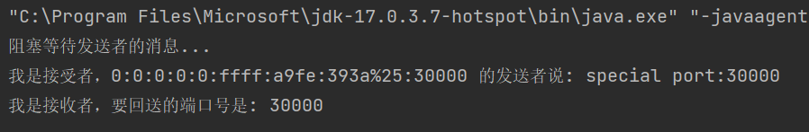

UDPSearcher

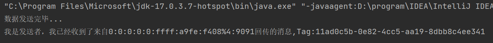

### task3

现使⽤UDP实现⽂件传输功能，给出UDPFileSender类、请完善UDPFileReceiver类，实现接收⽂件的功能。请测试在⽂件参数为1e3和1e8时的情况，将修改后的代码和运⾏时截图附在实验报告中，并对实验现象进⾏解释说明。

#### UDPFileReceiver

```java
        while(true){
            ds.receive(dp);
            int len = dp.getLength();
            String receiveString = new String(dp.getData(),0, len);
            if(receiveString.length() == 0)break;
            output.write(receiveString.getBytes());
        }
```

#### 运行结果

666数据规模下

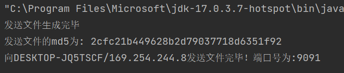

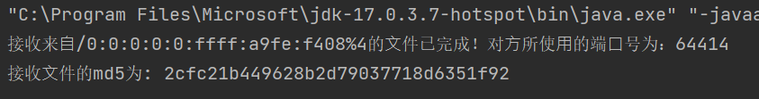

1e3情况下

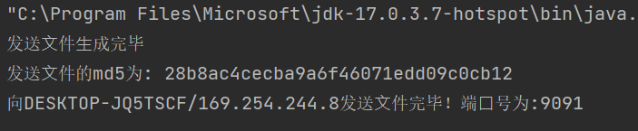


1e8情况下

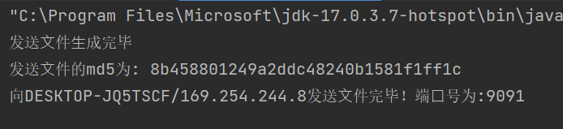

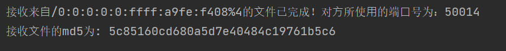

可以看到在大数据规模下md5值是不一样的，这说明通信过程中出现了一些问题。

但是，当我换了一个写法，是这样在UDPFileReceiver中实现相应的操作时：

```java
        while(true){
            ds.receive(dp);
            int len = dp.getLength();
            if(len == 0)break;
            output.write(data,0,len);
        }
```

数据规模666:

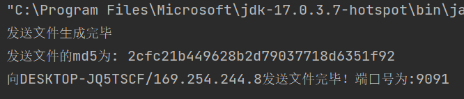

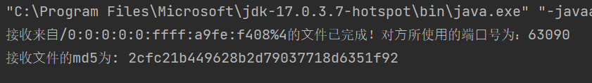

数据规模1e3:

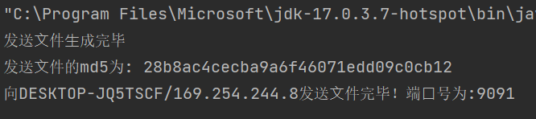

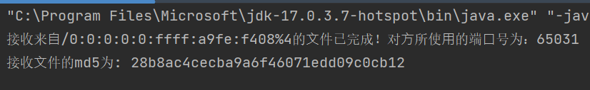

数据规模1e8:

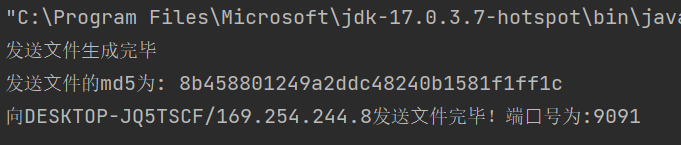

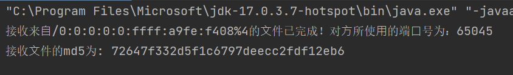

可以看到，在修改之后，1e3数据规模下发送和接受的数据时一样的，但是到1e8之下就不同了。结合所学知识，我试着来解释一下这个现象:

UDP 协议本身不保证可靠传输，数据包的传输可能丢失、重复、乱序等。在数据量较小时，可能存在丢失或重复数据包，但概率较小。在数据量较大时，出现这种情况的概率会增大，从而导致接收方接收到的数据与发送方发送的数据不同。

由于 UDP 协议是面向无连接的协议，不会建立连接来保证数据传输的可靠性。因此，网络环境不稳定时，会有更多的因素影响数据传输，从而导致接收方接收到的数据与发送方发送的数据不同。

至于解释为何我第一次实现和第二次实现有所不同，我认为是这样的——就是UDP协议本身并不保证可靠的传输，随着数据规模的增大，出错的概率也增大了，然后我的第一次实现更加复杂（先把数据包转化为字符串，再转化为Bytes型数组，再写入到文件中），这样中间相关函数的调用又增大了相关的不确定性。

### Bonus task1

 (2选1) 试完善⽂件传输功能，可选择 1.使⽤基于TCP的Socket进⾏改写；2.优化基于UDP⽂件传输，包括有序发送、接收端细粒度校验和发送端数据重传。请测试在⽂件参数为1e8时的情况，将修改后的代码和运⾏时截图附在实验报告中。

在这里我选择的工作是1

#### TCPFileSender

```java
import java.io.*;
import java.util.Random;
import java.net.Socket;

public class TCPFileSender {
    public static void main(String[] args) throws IOException {
        FileWriter fileWriter = new FileWriter("checksum.txt");
        Random r = new Random(2023);
        for (int i = 0; i < 1e8 ; i++) {
            fileWriter.write(r.nextInt());
        }

        File file = new File("checksum.txt");
        System.out.println("发送⽂件⽣成完毕");
        System.out.println("发送⽂件的md5为: " + MD5Util.getMD5(file));

        Socket clientSocket = new Socket("localhost", 9091);
        FileInputStream fis = new FileInputStream(file);
        OutputStream outputStream = clientSocket.getOutputStream();

        byte[] bytes = new byte[1024];
        int len;
        while ((len = fis.read(bytes)) != -1) {
            outputStream.write(bytes, 0, len);
        }

        byte[] a = new byte[0];
        outputStream.write(a);
        System.out.println("文件发送成功!");
        outputStream.close();
        fis.close();
        clientSocket.close();
    }
}

```

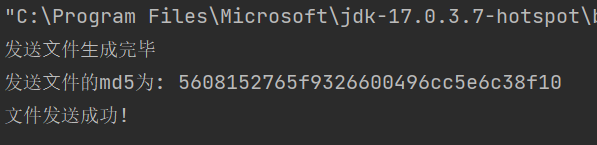

#### TCPFileReceiver

```java
import java.io.*;
import java.net.*;

public class TCPFileReceiver {
    public static void main(String[] args) throws IOException {
        File file = new File("checksum_recv.txt");
        FileOutputStream output = new FileOutputStream(file);
        ServerSocket serverSocket = new ServerSocket(9091);
        Socket socket = serverSocket.accept();
        InputStream inputStream = socket.getInputStream();
        byte[] data = new byte[1024];

        int len;
        while ((len = inputStream.read(data)) != -1) {
            if (len == 0) break;
            output.write(data,0,len);
        }
        System.out.println("文件接受完成,它的MD5:" + MD5Util.getMD5(file));
        inputStream.close();
        output.close();
        socket.close();
        serverSocket.close();
    }
}
```

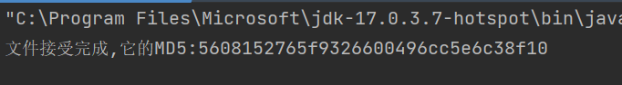

可以看到，采用TCP的文件传输是可靠的，即便是1e8这么大规模的数据也没有出现信息失真现象。

## 五、总结

UDP是一种面向数据报的传输协议，它简单、高效、轻量化，但是没有提供数据传输的可靠性保障，数据可能会丢失或乱序，这在需要确保文件可靠的场合下带来了不小的困难。TCP的传输虽然是可靠的，但是通信需要反复地建立和销毁连接，效率较差。

在这个实验过程中，通过实现UDP的相关功能，我对TCP和UDP的异同有了更深刻的认识。在更高程度的掌握的同时，希望我在未来能娴熟地根据不同的场景进行选择，最大化地利用好相关协议。

## 六、附录

#### task1的完整代码

##### UDPProvider

```java
import java.io.IOException;
import java.net.DatagramPacket;
import java.net.DatagramSocket;
import java.net.InetAddress;

public class UDPProvider {
    public static void main(String[] args) throws IOException {
        DatagramSocket datagramSocket = new DatagramSocket(9091);
        byte[] buf = new byte[1024];
        DatagramPacket receivePacket = new DatagramPacket(buf, 0, buf.length);
        System.out.println("阻塞等待发送者的消息...");
        datagramSocket.receive(receivePacket);
        String ip = receivePacket.getAddress().getHostAddress();
        int port = receivePacket.getPort();
        int len = receivePacket.getLength();
        String data = new String(receivePacket.getData(),0, len);
        System.out.println("我是接受者，" + ip + ":" + port + " 的发送者说: "+ data);

        byte[] sendBackData = data.getBytes();
        DatagramPacket sendBackPacket = new DatagramPacket(sendBackData, 0,sendBackData.length, InetAddress.getLocalHost(), port);
        datagramSocket.send(sendBackPacket);

        datagramSocket.close();
    }
}
```

##### UDPSearcher

```java
import java.io.IOException;
import java.net.DatagramPacket;
import java.net.DatagramSocket;
import java.net.InetAddress;
import java.nio.charset.StandardCharsets;
public class UDPSearcher {
    public static void main(String[] args) throws IOException {
        String sendData = "⽤户名admin; 密码123";
        byte[] sendBytes = sendData.getBytes(StandardCharsets.UTF_8);
        DatagramSocket datagramSocket = new DatagramSocket(9092);
        DatagramPacket sendPacket = new DatagramPacket(sendBytes, 0, sendBytes.length,
                InetAddress.getLocalHost(), 9091);
        datagramSocket.send(sendPacket);
        System.out.println("数据发送完毕...");

        byte[] buf = new byte[1024];
        DatagramPacket receiveBackPacket = new DatagramPacket(buf, 0, buf.length);
        datagramSocket.receive(receiveBackPacket);
        String receiveBackString = new String(receiveBackPacket.getData(), 0, receiveBackPacket.getLength());
        System.out.println("我是接受者，我已经收到了回传的消息:"+ receiveBackString);

        datagramSocket.close();
    }
}

```

#### task2的完整代码

##### MessageUtil

```java
class MessageUtil {
private static final String TAG_HEADER = "special tag:";
private static final String PORT_HEADER = "special port:";
public static String buildWithPort(int port) {
return PORT_HEADER + port;
 }
public static int parsePort(String data) {
if (data.startsWith(PORT_HEADER)) {
return Integer.parseInt(data.substring(PORT_HEADER.length()));
 }
return -1;
 }
public static String buildWithTag(String tag) {
return TAG_HEADER + tag;
 }
public static String parseTag(String data) {
if (data.startsWith(TAG_HEADER)) {
return data.substring(TAG_HEADER.length());
 }
return null;
 }
}

```


##### UDPSearcher

```java
import java.io.IOException;
import java.net.DatagramPacket;
import java.net.DatagramSocket;
import java.net.InetAddress;
import java.nio.charset.StandardCharsets;
import java.util.UUID;
public class UDPSearcher {
    public static void main(String[] args) throws IOException {
        int Port1 = 30000;
        String sendData = MessageUtil.buildWithPort(Port1);
        byte[] sendBytes = sendData.getBytes(StandardCharsets.UTF_8);
        DatagramSocket datagramSocket = new DatagramSocket(9092);

        DatagramPacket sendPacket = new DatagramPacket(sendBytes, 0, sendBytes.length,
                InetAddress.getByName("255.255.255.255"), 9091);
        datagramSocket.setBroadcast(true);
        datagramSocket.send(sendPacket);
        System.out.println("数据发送完毕...");

        DatagramSocket datagramSocket1 = new DatagramSocket(Port1);
        byte[] buf = new byte[1024];
        DatagramPacket receiveBackPacket = new DatagramPacket(buf, 0, buf.length);
        datagramSocket1.receive(receiveBackPacket);
        int Port2 = receiveBackPacket.getPort();
        int len = receiveBackPacket.getLength();
        String ip = receiveBackPacket.getAddress().getHostAddress();
        String receiveBackString = new String(receiveBackPacket.getData(), 0, len );
        System.out.println("我是发送者，我已经收到了来自"+ ip + ":" + Port2 + "回传的消息,Tag:" + MessageUtil.parseTag(receiveBackString));


        datagramSocket.close();
        datagramSocket1.close();
    }
}

```

##### UDPProvider

```java
import java.io.IOException;
import java.net.DatagramPacket;
import java.net.DatagramSocket;
import java.net.InetAddress;
import java.nio.charset.StandardCharsets;
import java.util.UUID;
public class UDPProvider {
    public static void main(String[] args) throws IOException {
        DatagramSocket datagramSocket = new DatagramSocket(9091);
        byte[] buf = new byte[1024];
        DatagramPacket receivePacket = new DatagramPacket(buf, 0, buf.length);
        System.out.println("阻塞等待发送者的消息...");
        datagramSocket.receive(receivePacket);


        int len = receivePacket.getLength();
        String data = new String(receivePacket.getData(),0, len);
        int port = MessageUtil.parsePort(data);
        String ip = receivePacket.getAddress().getHostAddress();
        System.out.println("我是接受者，" + ip + ":" + port + " 的发送者说: "+ data);
        System.out.println("我是接收者，要回送的端口号是: " + port);

        String tag = UUID.randomUUID().toString();
        String SendBackData = MessageUtil.buildWithTag(tag);
        byte[] SendBackDataBytes = SendBackData.getBytes();
        DatagramPacket SendBackPacket = new DatagramPacket(SendBackDataBytes, 0 ,
                SendBackDataBytes.length, InetAddress.getLocalHost() , port);
        datagramSocket.send(SendBackPacket);

        datagramSocket.close();
    }
}
```

#### task3的完整代码

##### UDPFileReceiver

```java
import java.io.*;
import java.net.DatagramPacket;
import java.net.DatagramSocket;
public class UDPFileReceiver {
    public static void main(String[] args) throws IOException {
        File file = new File("checksum_recv.txt"); //要接收的⽂件存放路径
        FileOutputStream output = new FileOutputStream(file);
        byte[] data=new byte[1024];
        DatagramSocket ds=new DatagramSocket(9091);
        DatagramPacket dp=new DatagramPacket(data, data.length);

        while(true){
            ds.receive(dp);
            int len = dp.getLength();
            String receiveString = new String(dp.getData(),0, len);
            if(receiveString.length() == 0)break;
            output.write(receiveString.getBytes());
        }

        output.close();
        ds.close();
        System.out.println("接收来⾃"+dp.getAddress().toString()+"的⽂件已完成！对⽅所使⽤的端⼝号为："+dp.getPort());
        file = new File("checksum_recv.txt");
        System.out.println("接收⽂件的md5为: " + MD5Util.getMD5(file));
    }
}
```

##### UDPFileSender

```java
import java.io.File;
import java.io.FileInputStream;
import java.io.FileWriter;
import java.io.IOException;
import java.net.DatagramPacket;
import java.net.DatagramSocket;
import java.net.InetAddress;
import java.security.NoSuchAlgorithmException;
import java.util.Random;
public class UDPFileSender {
    public static void main(String[] args) throws IOException, NoSuchAlgorithmException
    {
        // ⽣成并写⼊发送⽂件
        try (FileWriter fileWriter = new FileWriter("checksum.txt")) {
            Random r = new Random(2023);
            // 尝试 1e3 and 1e8
            for (int i = 0; i < 1000 ; i++) {
                fileWriter.write(r.nextInt());
            }
        }
        File file = new File("checksum.txt");
        System.out.println("发送⽂件⽣成完毕");
        System.out.println("发送⽂件的md5为: " + MD5Util.getMD5(file));
        FileInputStream fis = new FileInputStream(file);
        DatagramSocket socket = new DatagramSocket();
        byte[] bytes = new byte[1024];
        DatagramPacket packet;
        // 不断从⽂件读取字节并将其组装成数据报发送
        int len;
        for(;;){
            len = fis.read(bytes);
            if(len==-1) break;
            packet = new DatagramPacket(bytes, len, InetAddress.getLocalHost(), 9091);
            socket.send(packet);
        }
        // 空数组作为发送终⽌符
        byte[] a = new byte[0];
        packet = new DatagramPacket(a, a.length, InetAddress.getLocalHost(), 9091);
        socket.send(packet);
        fis.close();
        socket.close();
        System.out.println("向" + packet.getAddress().toString() + "发送⽂件完毕！端⼝号为:" + packet.getPort());
    }
}
```


## 

