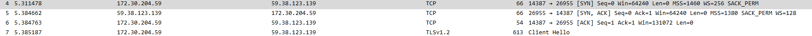

# 
华东师范大学数据科学与工程学院实验报告

|课程名称:计算机网络与编程 | 年级:22级 | 上机实践成绩: |
| ---- | ---- | ---- |
| 指导教师:张召 | 姓名:郭夏辉 | 学号:10211900416 |
| 上机实践名称:TCP协议分析 | 上机实践日期:2023年5月19日 | 上机实践编号:No.11 |
| 组号:1-416 | 上机实践时间:2023年5月19日 |      |

------

## 一、实验目的

- 了解 TCP 协议的工作原理
- 学习TCP建立连接三次握手的过程
- 学习TCP断开连接四次挥手的过程

## 二、实验任务

- 使用Wireshark快速了解TCP协议

## 三、实验过程

### task1

利用Wireshark抓取一个TCP数据包，查看其具体数据结构和实际的数据（要求根据报文结构正确标识每个部分），请将实验结果附在实验报告中。

首先还是来回顾一下TCP数据包的结构：

可以看到，这个相对于UDP数据包复杂得多，不过还是有很多相近的地方，接下来就让我结合具体的例子来分析一下吧:

这个相对于UDP数据包最大的不一样之处在于少了整个数据包的长度，然后多了很多和连接有关的状态量，比如序号、确认号——毕竟TCP是一种有连接的协议。

然后还有个比较有意思的就是我看到很多"relative"，说明这个序号、确认号是相对的。具体的解释还需要下周我在理论课学习TCP有关原理才能展开，但是我猜想这个是由于TCP的序号是建立在传送的字节流基础上的，而不是建立在传送的报文段的序列之上的，这就涉及到了相对和绝对的问题，确认号应该也与之同理。

而实际的数据是十六进制的，比如源端口:26955(0x694b):

### task2

根据TCP三次握手的交互图和抓到的TCP报文详细分析三次握手过程，请将实验结果附在实验报告中。

TCP建立连接时的三次握手原理:

我分析的例子:

第一次握手:

这时主要的工作是将SYN标志位设置为1，然后我们也可以看到这时序号seq为0，说明最初是从序号为0的包开始发送的；这时还没有收到服务器的响应，因此ack还为0。

第二次握手:

这时终于收到了服务器端的肯定了，所以ACK被设置为了1.

最开始的确认号被设置为了1(0+1=1)，由于TCP是累计确认的，这个意思是说1之前的数据包我已经收到并确认了，请你传之后的包。

有个值得注意的地方是这里的序号seq还是0，这说明服务器端的初始序号也是0，最初也是从序号为0的包开始发送的。

第三次握手:

这次握手是用户端发给服务器端的。有几个变化就是SYN重新被置为了0,由于是对服务器端的允许连接的报文进行确认，ACK还是被设置为1.

序号seq已经被设置为了1,表达的是向服务器端传送的第二个包。确认号也已经被设置为了1，意思是说1之前的数据包我已经收到并确认了，请你传之后的包。

一条TCP连接就这样建立起来了！

### task3

根据TCP四次挥手的交互图和抓到的TCP报文详细分析四次挥手过程，请将实验结果附在实验报告中。

在关闭一条TCP连接时，会发生四次挥手:

做这个实验尽量不要用大网站，因为使用大网站的话可能有多个服务端建立起了多个TCP连接，最后分析TCP连接关闭很容易非常混乱!

我结合的例子:

第一次挥手:

主动停止端发送 `FIN` 和 `ACK` 报文

服务端发送一个 `[FIN+ACK]` 报文，表示自己没有数据要发送了，想断开连接，并进入 `fin_wait_1` 状态（不能再发送数据到客户端，但能够发送控制信息 `ACK` 到客户端）。

第二次挥手:

被动停止端发送 `ACK` 报文给主动停止端

客户端收到 `[FIN]` 报文后，客户端知道不会再有数据从服务端传来，发送 `ACK` 进行确认，客户端进入 `close_wait` 状态。此时服务端收到了客户端对 `FIN` 的 `ACK` 后，进入 `fin_wait2` 状态。

第三次挥手:

被动停止端发送 `FIN` 和 `ACK` 报文给主动停止端

客户端发送 `[FIN ACK]` 报文给对方，表示自己没有数据要发送了，客户端进入 `last_ack` 状态。服务端收到了客户端的 `FIN` 信令后，进入 `time_wait` 状态，并发送 `ACK` 确认消息。

第四次挥手:

主动停止端发送 `ACK` 报文给被动停止端

服务端在 `time_wait` 状态下，等待一段时间，没有数据到来的，就认为对面已经收到了自己发送的 `ACK` 并正确关闭了进入 `close` 状态，自己也断开了到客户端的 `TCP` 连接，释放所有资源。当客户端收到服务端的`ACK` 回应后，会进入 `close` 状态，并关闭本端的会话接口，释放相应资源。

为了更明确化相关的序号seq和确认号ack之变化，我做了个小表格:

| 时间 | 序号seq | 确认号ack |
| ---- | ------- | --------- |
| 1    | 140     | 447       |
| 2    | 447     | 141       |
| 3    | 447     | 141       |
| 4    | 141     | 448       |

其实这个seq和ack变化的原理和task2中建立连接我已经详细说了，此处就不展开说了。

一条TCP连接终于关闭了！

注意,断开连接端可以是 `Client` 端，也可以是 `Server` 端，我上面的例子首先发起 `close` 的一方是 `Server` 端。

## 四、总结

这是一次难度不算大，但是十分有趣的实验。通过Wireshark抓包，TCP的建立和关闭连接的过程被直观地展现在我的面前。经过深入细致的实践，我对TCP/UDP这两个传输层协议有了更深刻的认识，希望我能在未来娴熟有效地利用好这两者，在计算机网络的世界中畅游！
