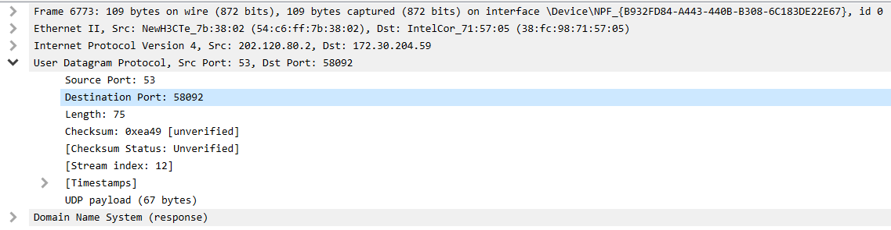
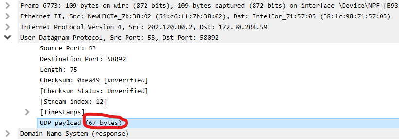
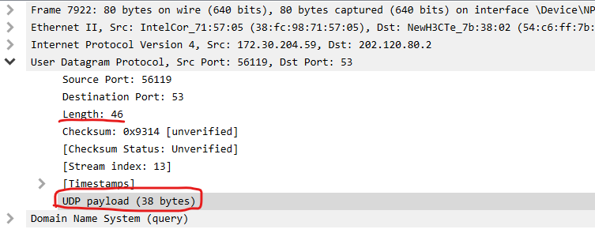
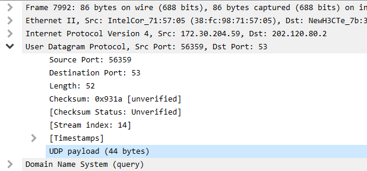
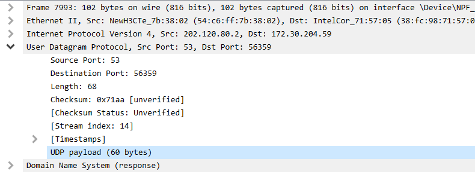

# 
华东师范大学数据科学与工程学院实验报告

|课程名称:计算机网络与编程 | 年级:22级 | 上机实践成绩: |
| ---- | ---- | ---- |
| 指导教师:张召 | 姓名:郭夏辉 | 学号:10211900416 |
| 上机实践名称:UDP协议分析 | 上机实践日期:2023年5月19日 | 上机实践编号:No.12 |
| 组号:1-416 | 上机实践时间:2023年5月19日 |      |

------

## 一、实验目的

- 了解 UDP 协议的工作原理

## 二、实验任务

- 使用Wireshark快速了解UDP协议

## 三、实验过程

### task1

从跟踪中选择一个 UDP 数据包。从此数据包中，识别并确定 UDP 首部字段，请为这些字段命名,并将实验结果附在实验报告中。

打开wireshark，输入拦截条件udp之后我截取到了一条udp类型的数据包:

回忆课堂所学知识，UDP数据包的首部有8个字节，由4个字段组成，它们分别是:源端口，目标端口，长度，校验和。

对于我截取到的UDP数据包，首部字段的相关信息十分清晰:

Source Port(源端口):53

Destination Port(目标端口):58092

Length(长度): 75

Checksum(校验和):0xea49 （可以在wireshark中看到这个还是没有经过验证的）

### task2

UDP首部中的长度字段指的是什么，以及为什么需要这样设计？使用捕获的 UDP 数据包进行验证，请将实验结果附在实验报告中。

我们还是结合task1中的例子继续来分析:

可以看到UDP的payload(这个被翻译为载荷，是UDP数据包的数据部分)为67字节。

75-67等于8!这个与UDP数据包的首部长度契合了，事实是不是真的如此呢？我结合另外一个UDP数据包来看，发现也是如此:

因此可以得到结论，就是首部字段中的Length指的是首部字段的长度(固定8字节)加上数据字段的长度，注意单位是字节！

然后就是一个比较开放的问题了——为什么要这样设计?

运输层利用UDP协议对报文进行传输时，其本质还是针对庞大的字节流的。在向上层(应用层)交换数据时，socket一定维护了一个相关的缓存，如果应用层来不及取UDP数据包，多个UDP数据包便被缓存了起来。在上层要交换数据时，是要经过这个缓存的，一个又一个地从UDP数据包的首部开始处理，这个过程中倘若UDP头不包含有关长度之信息，那么应用层面对字节流时就不清楚读取多少个字节才算读完了这个数据包。

总而言之，我感觉UDP首部字段的这个长度信息之作用就像是TCP协议中解决粘包问题而采用的在消息体中加入边界信息吧，这也是为何UDP协议使用过程中不会发生粘包现象。

### task3

 UDP 有效负载中可包含的最大字节数是多少？请将实验结果附在实验报告中。

考虑 UDP 包内的 Header 内的总长度字段，为 2Bytes，因此 UDP 数据包的总长度被限制为 $2^{16}-1=65535$ Bytes，但有效载荷（就是刚刚实验中看到的那个payload）还需考虑 Header 占据的字段大小，即 65535 再减去 UDP Header 本身所占用的 8 个字节，故UDP的服务中的最大有效负载长度为$65535-8=65527$ Bytes

### task4

观察发送 UDP 数据包后接收响应的 UDP 数据包，这是对发送的 UDP 数据包的回复，请描述两个数据包中端口号之间的关系。(提示：对于响应 UDP 目的地应该为发送 UDP 包的地址。）请将实验结果附在实验报告中。

我们来分析这一组UDP发送&接受记录

先来看发送者:

可以看到如下的信息:

发送者172.30.204.59 发送端口56359

接收者202.120.80.2 接收端口53

再看接收者:

可以看到如下的信息:

发送者202.120.80.2 发送端口53

接收者172.30.204.59 接收端口56359

非常神奇！数据发送者在接收返回的 UDP 协议数据包时，用于发送的端口号会变成接收端口号。同样地，数据接收者发送返回 UDP 时候用于接收的端口号会变成发送端口号。

## 四、总结

这是一次难度不算大，但是十分有趣的实验。通过Wireshark抓包，UDP的运行过程形象生动地展现在我的面前，而不仅仅是课本上一个公式化的定义。与此同时，钻研UDP为何要加入长度字段，也让我对网络的理解更进一步。
