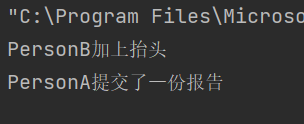
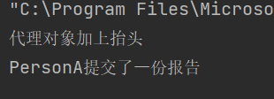
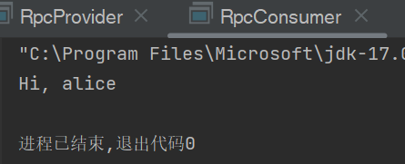

# <center>华东师范大学数据科学与工程学院实验报告</center>

|课程名称:计算机网络与编程 | 年级:22级 | 上机实践成绩: |
| ---- | ---- | ---- |
| 指导教师:张召 | 姓名:郭夏辉 | 学号:10211900416 |
| 上机实践名称:Java RPC原理及实现 | 上机实践日期:2023年6月2日 | 上机实践编号:No.13 |
| 组号:1-416 | 上机实践时间:2023年6月2日 |      |

------


## 一、实验目的

- 掌握RPC的⼯作原理 
- 掌握反射和代理

## 二、实验任务

- 编写静态/动态代理代码 
- 编写RPC相关代码并测试

## 三、使用环境

IntelliJ IDEA 

JDK 版本: Java 19

## 四、实验过程

### task1

测试并对⽐静态代理和动态代理，尝试给出⼀种应⽤场景，能使⽤到该代理设计模式。

代理模式的定义是为其他对象提供一种代理以控制对这个对象的访问，形象一点其实就像是我们通过“中介”来联系供应商买东西，这里中介便是供应商的代理。

代理对象并没有真正地提供服务，只是一个作为"中转者"的存在，仅仅在目标对象提供服务之前与之后执行一些额外的逻辑，进而达到功能增强的效果。

代理模式一般分为静态代理和动态代理。其中静态代理由程序员或者特定的工具创建，在代码编译时就确定了被代理的类，并且通常只代理一个类；但是动态代理在代码运行期间通过反射机制动态创建生成，可以代理一个接口下的多个实现类。如果使用的是动态代理，我们在完成相应的程序时根本就不需要知道代理谁，代理谁将会在执行阶段决定。

因为动态代理不需要根据接口提前定义代理类，而是将这种实现推迟到程序运行时由 JVM 来实现，在更换接口时，它不需要重新定义代理类，这显著地增强了类的可拓展性。但是由于动态代理使用了反射机制，可能在性能上相对于静态代理要稍逊一筹。

然后来分别运行一下两者的代码:

静态代理的测试结果:



动态代理的测试结果:



能看到两者的差异在于第一行，这与理论相互印证——在动态代理中，我们不需要事先写好代理类，而是在运行过程中动态生成。

**静态代理的使用场景**

在静态代理中，代理类和目标类之间是一对一的关系。

(1) 日志记录：在目标对象的方法执行前后添加日志记录的逻辑。

(2) 安全检查：在目标对象的方法执行前进行权限检查。

(3) 事务处理：在目标对象的方法执行前后开启、提交或回滚事务。

**动态代理运用场景** 

在动态代理中，代理类和目标类之间的关系是动态确定的，可以通过反射机制来生成代理类。动态代理常用于框架的实现中，如 Spring 框架中的 AOP（面向切面编程）。

(1) AOP：在目标对象的方法执行前后添加事务管理、日志记录等公共功能。

(2) 延迟加载：在需要时才加载目标对象，提高系统性能。

### task2

运⾏RpcProvider和RpcConsumer，给出⼀种新的⾃定义的报⽂格式，将修改的代码和运⾏结果截图，并结合代码阐述从客户端调⽤到获取结果的整个流程。

先运行RpcProvider再运行RpcConsumer，运行结果如下所示:


我自定义的rpc报文格式如下:

请求报文和响应报文的格式一样，都包含报文头部和报文数据部，两者的差别主要是messageType,如果是请求报文，则messageType为0，否则为1.

报文头部:

| 字段名称          | 字段长/字节数 | 描述                       |
| ----------------- | ------------- | -------------------------- |
| magic             | 2             | 标识RPC报文的开头          |
| headerLength      | 2             | rpc报文头部的长度          |
| messageType       | 1             | 消息类型(映射到具体的方法) |
| serializationType | 1             | 数据序列化类型             |

```java
import java.io.Serializable;
public class RpcHeader implements Serializable {
    private short magic;
    private short headerLength;
    private byte messageType;
    private byte serializerType;
    public RpcHeader(){};
    public RpcHeader(short magic, short headerLength, byte messageType,byte serializerType) {
        this.magic = magic;
        this.headerLength = headerLength;
        this.messageType = messageType;
        this.serializerType = serializerType;
    }
    public short getMagic() {
        return magic;
    }
    public void setMagic(short magic) {
        this.magic = magic;
    }
    public short getHeaderLength() {
        return headerLength;
    }
    public void setHeaderLength(short headerLength) {
        this.headerLength = headerLength;
    }
    public byte getMessageType() {
        return messageType;
    }
    public void setMessageType(byte messageType) {
        this.messageType = messageType;
    }
    public byte getSerializerType() {
        return serializerType;
    }
    public void setSerializerType(byte serializerType) {
        this.serializerType = serializerType;
    }
}

```

报文数据部:

| 字段名称       | 字段长/字节数 | 描述         |
| -------------- | ------------- | ------------ |
| methodName     | 可变          | 调用的方法名 |
| parameterTypes | 可变          | 参数类型列表 |
| arg            | 可变          | 方法的参数表 |

```java
import java.io.Serializable;
public class RpcData implements Serializable {
    private String methodName;
    private Class<?>[] parameterTypes;
    private Object[] args;
    public RpcData(String methodName, Class<?>[] parameterTypes, Object[]
            args) {
        this.methodName = methodName;
        this.parameterTypes = parameterTypes;
        this.args = args;
    }
    public String getMethodName() {
        return methodName;
    }
    public void setMethodName(String methodName) {
        this.methodName = methodName;
    }
    public Class<?>[] getParameterTypes() {
        return parameterTypes;
    }
    public void setParameterTypes(Class<?>[] parameterTypes) {
        this.parameterTypes = parameterTypes;
    }
    public Object[] getArgs() {
        return args;
    }
    public void setArgs(Object[] args) {
        this.args = args;
    }
}

```

组合一下,形成了Rpc报文类:

```java
import java.io.Serializable;
public class Rpc implements Serializable {
    private RpcHeader rpcHeader;
    private Object rpcData;
    public Rpc(RpcHeader rpcHeader, Object rpcData) {
        this.rpcHeader = rpcHeader;
        this.rpcData = rpcData;
    }
    public RpcHeader getRpcHeader() {
        return rpcHeader;
    }
    public void setRpcHeader(RpcHeader rpcHeader) {
        this.rpcHeader = rpcHeader;
    }
    public Object getRpcData() {
        return rpcData;
    }
    public void setRpcData(Object rpcData) {
        this.rpcData = rpcData;
    }
}

```

感觉这个问题主要的复杂之处在于明白给出的代码逻辑后添加相应的功能。

#### RpcProvider

RpcProvider类监听9091端口等待连接，如果有客户端连接，则创建Socket对象，通过ObjectInputStream从Socket的输入流中读取数据，同时要识别rpc请求报文的头部信息，并读取相应的数据。使用反射调用Proxy2Impl类的相应方法，将参数传递给该方法，返回的结果要经过合适的封装，然后递交给客户端。

明白了RpcProvider在干什么，我们当然要进行一些修改，根据请求报文中接收到的对象其magic来标识本次请求是否为rpc请求。如果是，则提取出rpc中的方法名，参数类型等请求信息后调用相应的方法，最后将返回值封装到rpc中，发送响应报文即可。

```java
import java.io.ObjectInputStream;
import java.io.ObjectOutputStream;
import java.net.InetSocketAddress;
import java.net.ServerSocket;
import java.net.Socket;
public class RpcProvider {
    public static void main(String[] args) {
        Proxy2Impl proxy2Impl = new Proxy2Impl();
        try (ServerSocket serverSocket = new ServerSocket()) {
            serverSocket.bind(new InetSocketAddress(9091));
            try (Socket socket = serverSocket.accept()) {
// ObjectInputStream/ObjectOutStream 提供了将对象序列化和反序列化的功能
                ObjectInputStream is = new
                        ObjectInputStream(socket.getInputStream());


                // rpc提供⽅和调⽤⽅之间协商的报⽂格式和序列化规则
                Object rpcObj = is.readObject();
                Rpc rpc = (Rpc) rpcObj;
                RpcHeader rpcHeader = rpc.getRpcHeader();
                if (rpcHeader.getMagic() != 0)
                    return;
                if (rpcHeader.getMessageType() == 0 && rpcHeader.getSerializerType() == (byte) 0) {
                    RpcData content = (RpcData) rpc.getRpcData();
                    String methodName = content.getMethodName();
                    Class<?>[] parameterTypes = content.getParameterTypes();
                    Object[] arguments = content.getArgs();

                    // rpc提供⽅调⽤本地的对象的⽅法
                    Object result = Proxy2Impl.class.getMethod(methodName, parameterTypes).invoke(proxy2Impl, arguments);
                    // 将结果序列化并返回
                    new ObjectOutputStream(socket.getOutputStream()).writeObject(new Rpc(getHeader(), result));
                }
            }
        } catch (Exception e) {
            e.printStackTrace();
        }
    }

    private static RpcHeader getHeader() {
        short magic = 0;
        short headerLength = 6;
        byte messageType = 1;
        byte serializeType = (byte) 0;
        return new RpcHeader(magic, headerLength, messageType, serializeType);
    }
}
```

#### RpcConsumer

iProxy2Handler对象实现了InvocationHandler接口，用于处理代理对象的方法调用，围绕着RpcConsumer类的修改主要是围绕iProxy2Handler类的修改进行。在已经给出的代码的基础上，因为我们自定义的响应和请求报文都是以Rpc类为载体进行的，因此这里的主要操作在于对Rpc类中的数据提取并解析，得到返回值。

```java
import java.io.ObjectInputStream;
import java.io.ObjectOutputStream;
import java.lang.reflect.InvocationHandler;
import java.lang.reflect.Method;
import java.net.InetSocketAddress;
import java.net.Socket;

class iProxy2Handler implements InvocationHandler {
    @Override
    public Object invoke(Object proxy, Method method, Object[] args) throws
            Throwable {
        Socket socket = new Socket();
        socket.connect(new InetSocketAddress(9091));
        ObjectOutputStream os = new
                ObjectOutputStream(socket.getOutputStream());


        // rpc提供⽅和调⽤⽅之间协商的报⽂格式和序列化规则
        RpcHeader header = getHeader();
        RpcData content = new RpcData(method.getName(),method.getParameterTypes(),args);
        os.writeObject(new Rpc(header,content));


        Object result = new ObjectInputStream(socket.getInputStream()).readObject();
        Rpc rpc = (Rpc) result;
        return rpc.getRpcData();
    }
    private static RpcHeader getHeader() {
        short magic = 0;
        short headerLength = 6;
        byte messageType = 0;
        byte serializeType = (byte) 0;
        return new RpcHeader(magic, headerLength, messageType, serializeType);
    }
}
```

运行结果如下所示:



### task3

查阅资料，⽐较⾃定义报⽂的RPC和http1.0协议，哪⼀个更适合⽤于后端进程通信，为什么？

- 自定义报文的RPC协议

自定义报文的RPC协议是一种基于TCP协议的面向过程的远程过程调用协议，使用自定义报文进行通信。是一种通过网络从远程计算机程序上请求服务，而不需要了解底层网络技术的协议。支持多种操作系统和编程语言，提供了良好的可扩展性和灵活性。

1. 该协议可根据具体的需求设计报文格式，灵活性很高；
2. 该协议可以灵活选择序列化和反序列化的方式，比如使用Java的序列化；
3. 该协议可以根据具体需求进行定制，可以支持丰富的功能特性，如负载均衡，可以充分地满足后端通信的复杂要求。

- HTTP 1.0协议

HTTP1.0是一种基于TCP协议的无状态，无连接的应用层协议，采用请求-响应模式进行通信。

1. 该协议有着固定的报文格式，拓展性较差；
2. 该协议通常使用文本格式传输数据，还需要在请求和响应中进行序列化 和反序列化；
3. 该协议相对简单，功能特性有限，主要用于传输请求和响应数据。
4. 该协议有缓存机制，可以将常用的数据缓存到浏览器端，提高了整体的性能。

综上所述，自定义报文的RPC协议更适合用于后端进程通信。RPC协议面向过程，可以直接操作底层的二进制数据，效率较高；并且拓展性很强，支持更多的复杂需求。

## 五、总结

本次实验对我来说难度挺大。由于实验文档的不完整性，自己花了很多时间去了解、掌握RPC的相关机制。

Socket 和 HTTP 编程使用消息传递范式。客户端向服务器发送一个消息，而服务器通常会发送一个消息回来。双方都负责以双方都能理解的格式创建消息，并从这些消息中读出数据。然而，大多数独立的应用程序并没有那么多地使用消息传递技术。一般来说，首选的机制是函数调用，在这种方式中程序将调用一个带有参数列表的函数，并在完成函数调用后有一组返回值。这些值可能是函数值，或者如果地址被作为参数传递，那么这些地址的内容可能已经被改变。RPC 就是将这种编程方式引入网络世界的一种尝试。因此，客户端将进行在它看来是正常的过程调用。客户端会将其打包成网络消息并传送给服务器。服务器会将其解包，并在服务器端将其转回为过程调用。服务器端的过程调用。这个调用的结果将被打包，以便返回给客户端。

而且第二个任务我觉得特别有新意，之前是沿着课本的定义去抓包，然后看到了互联网世界中司空见惯的TCP/UDP/HTTP等协议的报文，现在是自己设计一套新的报文结构然后进行通信，这无疑让自己收获很多。

RPC在未来自己学习分布式系统的过程中还会遇到，有着广泛的应用场景和深刻的优点，希望自己能用好RPC的相关特性，在未来的学习中最大化它的价值。
