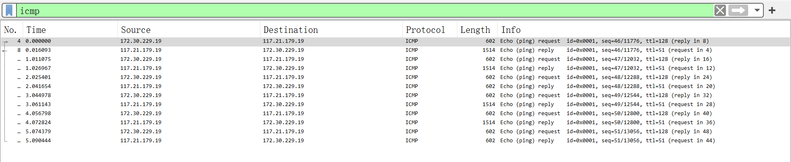

# 
华东师范大学数据科学与工程学院实验报告

| 课程名称:计算机网络与编程 | 年级:22级                 | 上机实践成绩:      |
| ------------------------- | ------------------------- | ------------------ |
| 指导教师:张召             | 姓名:郭夏辉               | 学号:10211900416   |
| 上机实践名称:IP协议分析   | 上机实践日期:2023年6月9日 | 上机实践编号:No.14 |
| 组号:1-416                | 上机实践时间:2023年6月9日 |                    |

------

## 一、实验目的

- 快速简单了解IP协议，特别是IP数据报 
- 了解IP数据报各字段的含义 
- 研究IP数据的分片方法

## 二、实验任务

- 使用Wireshark快速了解IP协议

## 三、实验过程

### task1

任取一个有IP协议的ICMP数据报并根据该报文分析IP协议的报文格式（正确标注每一个部分），请将实验结果附在实验报告中。

首先我们还是来回顾一下IP报文的基本格式:

我选择bilibili.com作为本实验的对象:

与此同时，在wireshark中选择icmp过滤条件:

然后我任取了一个有IP协议的ICMP数据报进行分析:

**版本Version:**

可以看到这个IP协议版本是ipv4

**首部长度Header Length:**

可以看到这个IP报文的首部长度是20bytes

这也意味着报文的"可选"部分是不存在的。

**区分服务Differentiated Services Field:**

0x00代表区分服务字段，这个被路由器用来进行流量的优先级排序

这个部分占8位，用于标识该数据包的服务类型。

**总长度Total Length:**

这里的长度指的是 IP 首部和数据报中数据之后的长度，单位为字节，可以看到这个IP报文的总长度是588字节。

**标识字段Identification:**

标识字段是一个标识数字，用来唯一地标识一个数据报的次序。

**标志 Flags:**

Flags一般占3位，其中一位为0，另外两位用于数据报分片（不分片、后续分片、首个分片）。

标志字段中的最低位记为 MF,MF=1即表示后面“还有分片”的数据报,MF=0 表示这已是若干数据包分片中的最后一个。

标志字段中间的一位记为 DF意思是 “不能分片”,因此只有当 DF=0 时才可以分片。

还有个小小的知识需要补充:

>每个分片除了最后一个分片外，都需要设置MF标志为1，表示该分片不是最后一 个分片,也需要设置分片偏移量字段表示该分片的位置，每个分片偏移量必须是8字节的倍数。
>
>最后一个分片的MF标志设置为0，表示这是最后一个分片。

该报文的Flags字段值为0，表达的是没有MF(More Fragment)了，即这是最后一个包。

**片偏移Fragment Offset:**

占13位，表示数据报分片的位置。一个数据报是一个分片，这个域中的值就会被用来将数据报以正确的顺序重新组装。这里的片偏移是4440，之所以会出现这样的偏移量，是可以被计算的:

我发送的数据包大小是5000字节，MTU一般为1500字节，除去IP报文的首部，只有1480字节了。而且这是最后一个包(根据刚刚对Flags的分析)，而5000字节最多容纳3个1500字节的包，所以这也是第三个包，即片偏移量为3*1480=4440

**生存时间Time to Live:**

占8位，表示数据报在网络中传输的最大跳数。这样做确保了数据包不会在网络中无限循环，每一台路由器处理数据时，值减一。可以看到这个数据报在网络中传输的最大128跳，这还是很大的一个数。

**协议 Protocal:**

这里采用的是ICMP协议。

这里表示了该报文数据部分使用的协议类型，TCP、UDP或ICMP等都可以在此表示。

**首部检验和 Header Checksum:**

占16位，用于查验IP首部是否在传输过程中被修改。这里头部校验和为0.

注意这里的校验和只针对首部，而不涉及数据部。

**源地址Source Address:**

源地址是172.30.229.19

可以看到这个部分占了32位，这也是ipv4的特性

**目的地址Destination Address:**

目标地址是117.21.179.19

可以看到这个部分占了32位，这也是ipv4的特性

**可选字段Options:**

这个报文没有

### task2

对截获的报文进行分析，将属于同一个ICMP请求报文的分片找出来，并分析其字节长度特点 （如，每个分片的大小，片偏移等），请将实验结果附在实验报告中。

还是在这个wireshark的抓取列表中:

选择一个ICMP请求报文，双击查看详细信息:

这个 ICMP 请求报文被分成了 4 个分片:

Frame:9，1500 字节，有效载荷 1480 字节 片偏移量0

Frame:10，1500 字节，有效载荷 1480 字节 片偏移量1480

Frame:11，1500 字节，有效载荷 1480 字节 片偏移量2960

Frame:12，588字节，有效载荷 568 字节 片偏移量4440

前三个分片的大小都是1500字节，这主要是由于MTU限制。

至于具体的片偏移量和分片的理论分析，我在task1中其实有较为详细的解释，此处就不赘述了。

## 四、总结

在本次实验最初，我向`www.ecnu.edu.cn`发包，但是结果却是这样的:

学校的官网(www.ecnu.edu.cn)是确实存在的，但是为什么ping的时候一直超时呢？我推测该网站设置了 ICMP 数据包过滤，诸如相关防火墙设置把我的ping请求屏蔽掉了。

在task2中，我发现一个很有意思的现象，就是自己发送的包是5000字节的，但是那4个分片的有效载荷加起来却是1480*3+568=5008字节，为什么会多出来的8字节呢？

在重组过程中，所有分片的有效负载都会被组装在一起，从而构成原始数据包，在每个分片中包含 IP 包头和 ICMP 包头的信息也会被添加到有效载荷中。这样一来，重组后的数据包大小就比原始的大了一些，这8个字节就是ICMP首部信息。

这次实验并不是很难，自己结合着Wireshark的直观展示，通过IP报文的基本结构，对相关的分片等现象有了更深刻的理解。同时，我也在仔细的观察中，发现了自己仅仅靠阅读课本难以察觉的小细节，为自己利用网络层的相关协议打下了坚实的基础。

